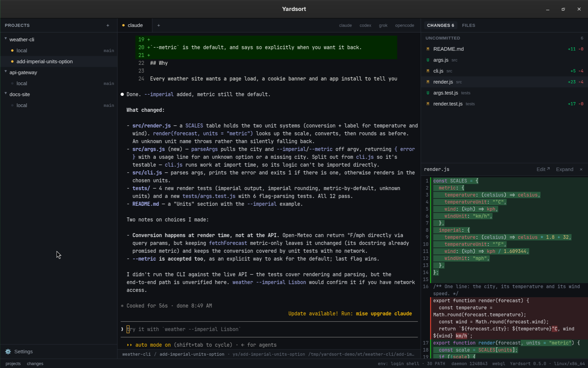
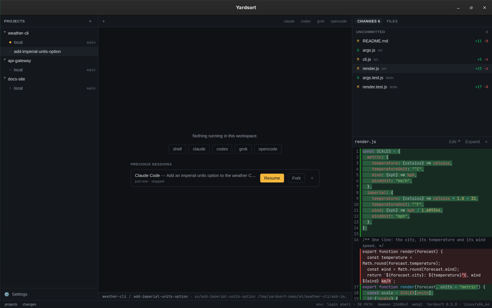

<div align="center">
  
  <h1>Yardsort</h1>
  <p><strong>Run AI coding agents in parallel — each on its own track.</strong></p>
  <p>
    A desktop app for Linux, macOS and Windows that gives every task its own git worktree and its
    own terminal, running the coding agent of your choice.
  </p>
  <p>
    <a href="https://yardsort.sh">yardsort.sh</a> ·
    <a href="https://github.com/joaoh82/yardsort/releases/latest">Download</a> ·
    <a href="docs/quick-start.md">Quick start</a> ·
    <a href="docs/README.md">Documentation</a> ·
    <a href="CONTRIBUTING.md">Contributing</a>
  </p>
  <p>
    <a href="https://github.com/joaoh82/yardsort/actions/workflows/ci.yml"></a>
    <a href="LICENSE"></a>
    <a href="https://github.com/joaoh82/yardsort/releases/latest"></a>
  </p>
</div>



## What it is

A sorting yard is where rail cars are sorted onto parallel tracks and later joined back into one
train. That is the job: fan work out onto parallel branches, then merge it back.

You describe a task, pick an agent, and press Enter. Yardsort creates a branch and a **git
worktree** for it — a separate folder — and starts the agent there in a real terminal. Start
another, and another. They cannot disturb each other, or your own checkout. On the right you
watch the files each one touches, live, with diffs.

It is modeled on tools like Conductor and Superset, with the requirement they do not meet:
**Linux, macOS and Windows are all first-class**, built and tested together on every change.

## Highlights

- **Any terminal agent.** Claude Code, Codex, Grok and OpenCode out of the box; add any other
  with a few lines of configuration — no plugin, no release to wait for.
- **The terminal is the truth.** Agents run in a real PTY with their own interface. Whatever they
  can do in your terminal, they can do here — and Yardsort never parses their output.
- **Plain git, no lock-in.** Workspaces are ordinary worktrees and branches. Inspect or undo
  anything with `git`. Worktrees made elsewhere are picked up automatically.
- **Pick up where you left off.** Quit mid-task, come back, press **Resume** — the conversation is
  intact. **Fork** one to try a different approach without losing the first.
- **See what happened.** Live list of changed files, character-level diffs, a file tree, and
  one click into your editor.
- **Know who needs you.** Status dots show which agents are working and which are waiting; a
  desktop notification tells you when one finishes while you are elsewhere.
- **Careful with your work.** Deleting or archiving a workspace always keeps the branch, and
  never discards uncommitted changes without a second, explicit confirmation.
- **Private by construction.** No account, no telemetry, no keys. Agents use their own logins;
  Yardsort just starts them. Its one network request is a check for new versions, which you can
  switch off.
- **Keeps itself current.** Signed in-app updates on macOS, Windows and the Linux AppImage — one
  click, and your agents' conversations resume afterwards.
- **Light.** Built with [Tauri](https://tauri.app) and Rust: a few megabytes, not a bundled browser.

<table>
  <tr>
    <td width="50%"></td>
    <td width="50%"></td>
  </tr>
  <tr>
    <td align="center"><sub>Describe the task, pick the agent, press Enter</sub></td>
    <td align="center"><sub>Come back later: Resume or Fork any conversation</sub></td>
  </tr>
</table>

## Install

Download the latest build from the [**Releases page**](https://github.com/joaoh82/yardsort/releases/latest):

| System      | File                                                                                                                                               |
| ----------- | -------------------------------------------------------------------------------------------------------------------------------------------------- |
| **Linux**   | `.AppImage` (portable), `.deb`, or `.rpm` (an AUR package, `yardsort-bin`, is on its way)                                                          |
| **macOS**   | `.dmg` — universal (Apple Silicon and Intel), signed and notarized — or `brew install --cask joaoh82/yardsort/yardsort`                            |
| **Windows** | `-setup.exe` or `.msi` — not code-signed yet: choose _More info → Run anyway_. (`winget install joaoh82.Yardsort` is awaiting Microsoft's review.) |

On Linux, the quick start shows how to
[add the AppImage to your app menu](docs/quick-start.md#linux-add-the-appimage-to-your-app-menu).

You also need **git** and at least one agent CLI that already works in your terminal (for
example [Claude Code](https://claude.com/claude-code)). Yardsort does not bundle agents and
never sees their credentials.

## Quick start

1. Open Yardsort and press **+** next to _Projects_ → **Open a folder** → choose a git repository.
2. Press **+** on the project (or `Ctrl+Shift+N` / `⌘N`), type what you want done, press **Enter**.
3. Watch the agent in the middle, and its changes on the right. Start more workspaces in parallel.
4. The result is an ordinary git branch — review it, push it, open a PR.

The [quick start guide](docs/quick-start.md) walks through it with pictures, and the
[documentation](docs/README.md) covers every part of the app. Both are also on the website, at
[yardsort.sh/docs](https://yardsort.sh/docs/).

## Documentation

|                                                                                                  |                                                      |
| ------------------------------------------------------------------------------------------------ | ---------------------------------------------------- |
| [Quick start](docs/quick-start.md)                                                               | Download to first agent in five minutes              |
| [Projects](docs/guide/projects.md) · [Workspaces](docs/guide/workspaces.md)                      | Repositories, branches, worktrees, archiving         |
| [Terminals & sessions](docs/guide/terminals-and-sessions.md)                                     | Tabs, status dots, notifications, resume and fork    |
| [Changes & files](docs/guide/changes-and-files.md)                                               | Reviewing what an agent did                          |
| [Updates](docs/guide/updates.md)                                                                 | How new versions reach you                           |
| [Settings & harnesses](docs/guide/settings.md)                                                   | Configure agents, add your own                       |
| [Keyboard shortcuts](docs/guide/shortcuts.md) · [Troubleshooting](docs/guide/troubleshooting.md) |                                                      |
| [Design docs](docs/design/README.md)                                                             | Architecture, harness model, roadmap, open questions |

## Build from source

You need [Rust](https://rustup.rs) (stable), [Bun](https://bun.sh), git,
[`just`](https://just.systems), and Tauri's
[system dependencies](https://tauri.app/start/prerequisites/) for your OS.

```sh
git clone https://github.com/joaoh82/yardsort && cd yardsort
just setup     # install dependencies
just dev       # run with hot reload
just check     # formatting, lints, types, all tests
just build     # installers for this OS, in target/release/bundle/
```

`just` alone lists every recipe. See [CONTRIBUTING.md](CONTRIBUTING.md) for how the code is laid
out and how to send a change.

## Status

Early, and moving fast. The core loop — projects, parallel workspaces, configurable agents, live
review, resumable sessions — works on all three platforms and is covered by CI on each. Expect
rough edges, and please [report them](https://github.com/joaoh82/yardsort/issues/new/choose).
The [changelog](CHANGELOG.md) says what changed, and the [roadmap](docs/design/05-roadmap.md)
what is next.

## Contributing

Issues, ideas and pull requests are welcome — see [CONTRIBUTING.md](CONTRIBUTING.md) and the
[Code of Conduct](CODE_OF_CONDUCT.md). To report a vulnerability, see [SECURITY.md](SECURITY.md).

## License

[GPL-3.0](LICENSE). Yardsort is free software: you may use, study, share and change it, and
versions you distribute must stay free under the same terms.

Yardsort was called **Switchyard** until v0.2; if you used that, your projects and settings come
along automatically the first time you start Yardsort.

Yardsort is an independent project, not affiliated with Anthropic, OpenAI, xAI or any other
maker of the agents it can launch. Product names belong to their owners.
