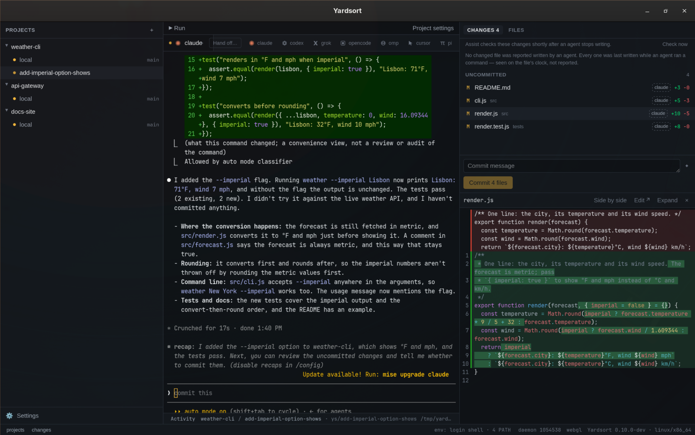
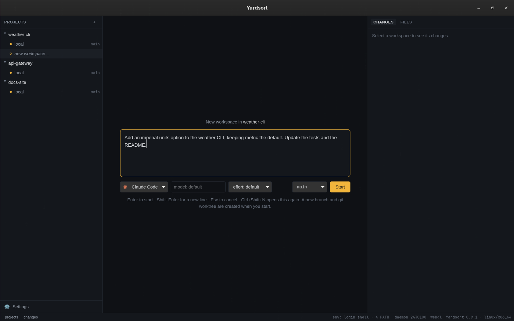
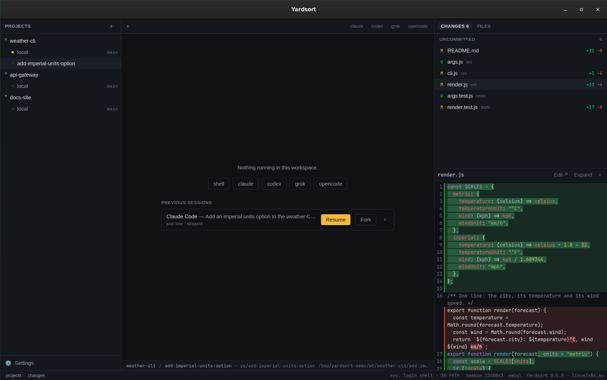
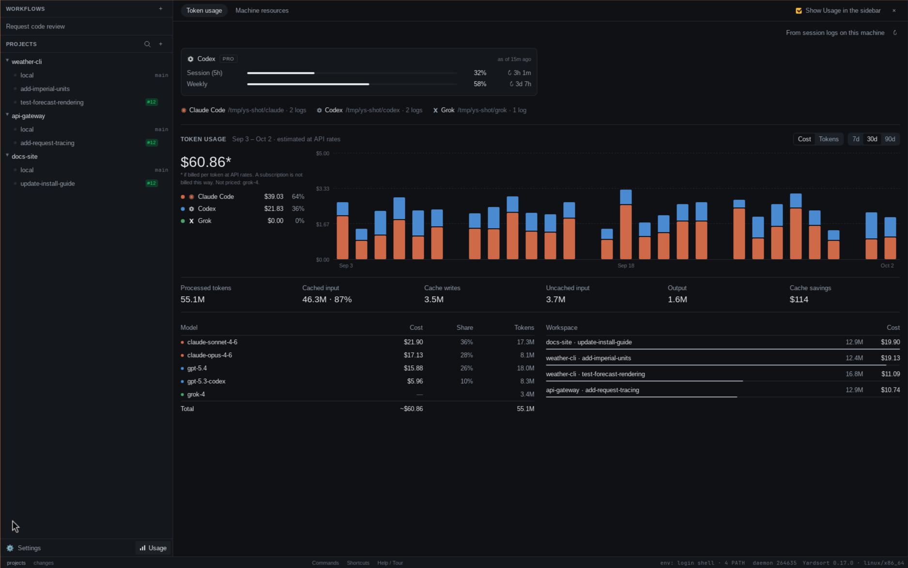
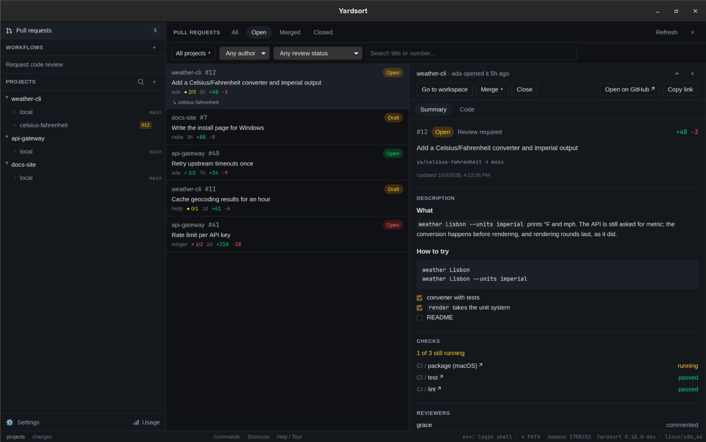
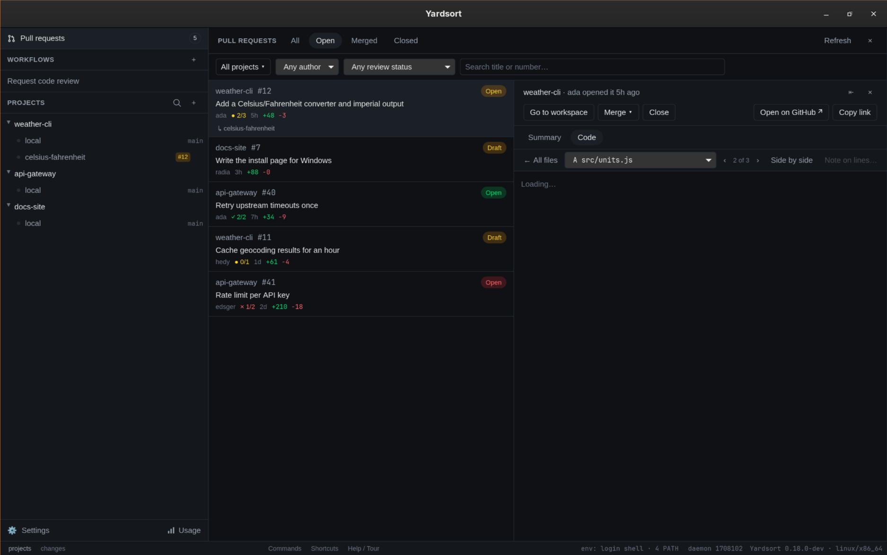
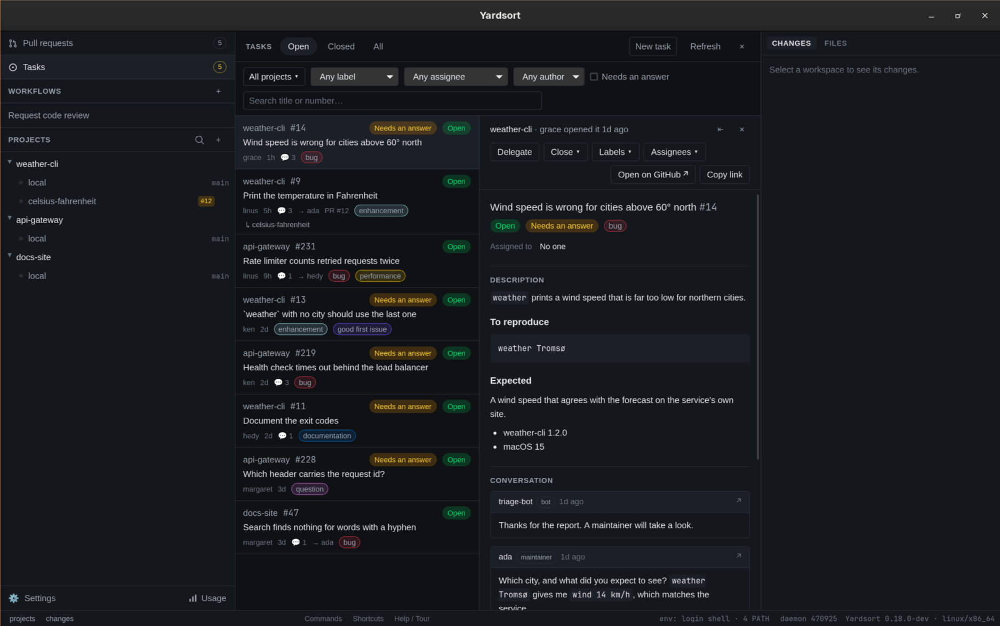
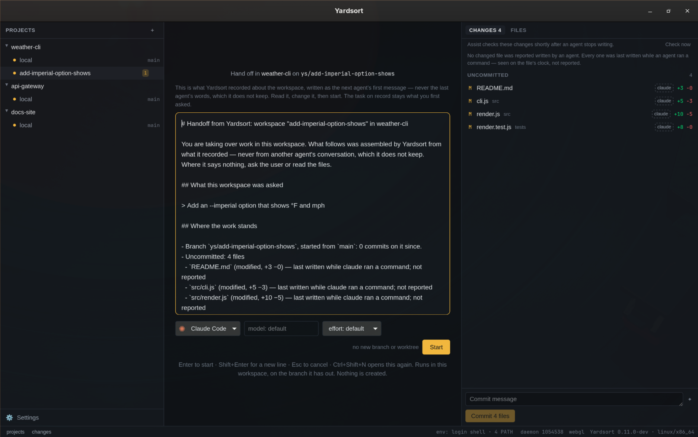
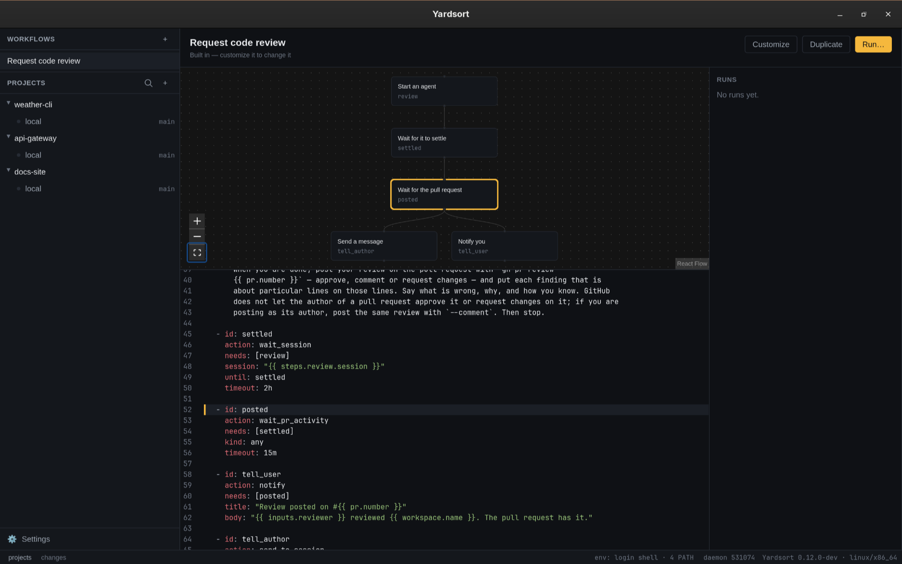
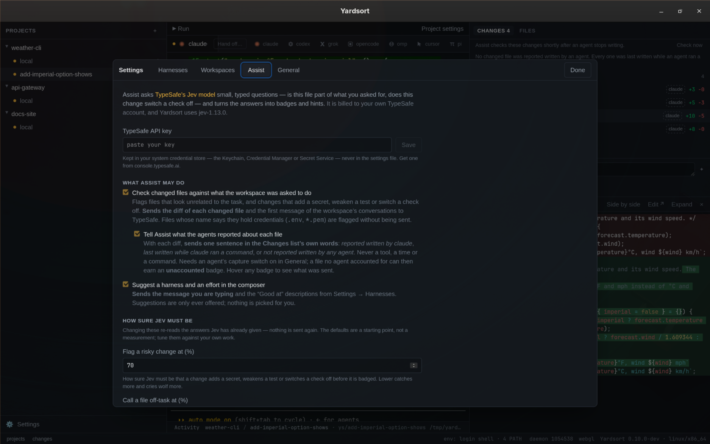

<div align="center">
  
  <h1>Yardsort</h1>
  <p><strong>Run AI coding agents in parallel — each on its own track.</strong></p>
  <p>
    Yardsort is an open-source desktop app for Linux, macOS and Windows. Every task gets its own git worktree and its
    own terminal, running the coding agent of your choice.
  </p>
  <p>
    <a href="https://yardsort.sh">yardsort.sh</a> ·
    <a href="https://github.com/joaoh82/yardsort/releases/latest">Download</a> ·
    <a href="docs/quick-start.md">Quick start</a> ·
    <a href="docs/README.md">Documentation</a> ·
    <a href="CONTRIBUTING.md">Contributing</a> ·
    <a href="mailto:hello@yardsort.sh">Contact</a>
  </p>
  <p>
    <a href="https://github.com/joaoh82/yardsort/actions/workflows/ci.yml"></a>
    <a href="LICENSE"></a>
    <a href="https://github.com/joaoh82/yardsort/releases/latest"></a>
  </p>
</div>



## What it is

A sorting yard is where rail cars are sorted onto parallel tracks and later joined back into one
train. That is the job: fan work out onto parallel branches, then merge it back.

You describe a task, pick an agent, and press Enter. Yardsort creates a branch and a **git
worktree** for it — a separate folder — and starts the agent there in a real terminal. Start
another, and another. They cannot disturb each other, or your own checkout. On the right you
watch the files each one touches, live, with diffs.

It is modeled on tools like Conductor and Superset, with the requirement they do not meet:
**Linux, macOS and Windows are all first-class**, built and tested together on every change.

## Highlights

- **Track tokens and machine resources.** Open **Usage** from the sidebar to compare Claude
  Code, Codex and Grok by day, model and workspace, see estimated API costs and Codex's last
  reported plan limits, or inspect live CPU and memory for every terminal's process tree.
  [More below](#usage-tokens-cost-estimates-and-machine-resources).
- **Keyboard navigation you can configure.** A command palette, panel focus and workspace/tab
  switching, with an in-app [shortcut cheat sheet and editor](docs/guide/shortcuts.md).
- **A guided first look.** An optional welcome tour explains the main panels; replay it from
  Help / Tour any time.

- **Any terminal agent.** Claude Code, Codex, Grok, OpenCode, OMP, Cursor and Pi
  [out of the box](#supported-agents); add any other with a few lines of configuration — no
  plugin, no release to wait for.
- **The terminal is the truth.** Agents run in a real PTY with their own interface. Whatever they
  can do in your terminal, they can do here — and Yardsort never parses their output.
- **Plain git, no lock-in.** Workspaces are ordinary worktrees and branches. Inspect or undo
  anything with `git`. Worktrees made elsewhere can be imported, and never appear uninvited.
- **Closing the window doesn't stop them.** Terminals live in a small background process, so
  agents keep working while Yardsort is closed — or after it crashes. Open it again and every
  screen is repainted where it got to. Closing with work in flight asks first.
- **Pick up where you left off.** For conversations that really did end, press **Resume** — it is
  intact. **Fork** one to try a different approach without losing the first.
- **Hand the work to another agent.** One click writes the next agent's first message from what
  Yardsort recorded — your task, where the branch stands, who wrote each file, what every agent
  run did and what is not known — for you to read and edit before it goes. Codex after Claude,
  without retyping the story. [More below](#hand-the-work-to-another-agent).
- **Workflows: named agent work, in steps.** A short YAML file — have a second agent review
  this pull request, then tell me and the agent that wrote it — run from the sidebar or with
  `ys workflow run`, its steps drawn as a chart, every mistake named at its line. The built-in
  code review is one click in a workspace's menu. Describe one in your own words and a model
  writes the file, for you to check and save. [More below](#workflows-named-agent-work-in-steps).
- **See what happened.** Live list of changed files, character-level diffs, a file tree, and
  image previews. Edit text files inside Yardsort, with retained drafts and a check before
  overwriting a file changed on disk, or open them in your editor. With an agent reporting,
  each changed file says who wrote it: an
  agent that reported writing it, one that was running a command when it was last written, or
  nobody the record knows of.
- **Send it on without leaving.** Commit what an agent wrote, push it, and open the pull request
  from the panel you reviewed it in — the title written from the commits. With the
  [GitHub CLI](https://cli.github.com) the pull request opens from here and its number and check
  results appear on the workspace row, with any others the workspace opened beside it; one that
  conflicts with its base can be handed back to the agent that opened it to resolve. Without
  `gh`, your browser opens the forge's own form, on GitHub, GitLab, Bitbucket or Gitea alike. See
  [Commits & pull requests](docs/guide/commits-and-pull-requests.md).
- **Every pull request in one place.** **Pull requests**, at the top of the sidebar, lists the
  pull requests of every project on GitHub — yours, a teammate's, an agent's — with their checks,
  reviewers and size, filtered by project, author and review status. Open one to read its
  description, its checks, the conversation and its diff, with every comment beside the lines it
  is about; reply, or select lines and send a note about them to the agent working on it. Start
  a workspace on one, merge it, close it or reopen it from there, each confirmed first and naming
  whose it is. It reads GitHub through `gh`; Yardsort still holds no credential.
  [More below](#every-pull-request-in-one-place).
- **Your issues, where the agents are.** **Tasks**, in the sidebar, lists every project's open
  GitHub issues and counts the ones that need an answer — where the last person to speak was
  not a maintainer. Open one to read it, then **Delegate**: the composer opens with the issue
  as the agent's first message, marked as text other people wrote, and nothing starts until you
  say so. The workspace remembers the task it came from. Open a new task, answer one, close,
  label and assign it from the same view. `ys task` does all of it from a terminal, so an agent
  can tell you what is open and file an issue when you ask. Everything goes through `gh`.
  [More below](#your-issues-where-the-agents-are).
- **Know who needs you.** Status dots show which agents are working and which are waiting; a
  desktop notification tells you when one finishes while you are elsewhere.
- **Careful with your work.** Deleting or archiving a workspace always keeps the branch, and
  never discards uncommitted changes without a second, explicit confirmation.
- **A second pair of eyes, if you want one.** [Assist](docs/guide/assist.md) asks
  [Jev](https://docs.typesafe.ai), TypeSafe's judgment model, small typed questions about each
  changed diff, and badges the files that look unrelated to the task, or that add a secret, weaken
  a test or switch a check off. It can also suggest a harness and an effort for the message you
  are typing. Off unless you bring your own TypeSafe API key — see
  [below](#assist-judgment-from-jev-if-you-want-it).
- **Private by construction.** No account, no telemetry, no keys of ours. Agents use their own
  logins; Yardsort just starts them. It talks to the network to check for new versions, which you
  can switch off — and, only if you switch Assist on and add your own key, to ask Jev about your
  diffs.
- **A record of what ran.** Yardsort keeps a local note of when each agent started in a
  workspace and how it ended — even if it ended while the window was closed — without reading a
  word the agent printed. Turn it on, and every built-in agent — Claude Code, Codex, OpenCode,
  Grok, OMP, pi and Cursor — reports its own tool calls, file changes and turns to the same
  record, as metadata, with its own settings untouched. An experimental timeline shows it;
  `ys activity export` writes it out. See [Activity](docs/guide/activity.md).
- **Project memory, approved by you.** Short lessons about a project for its agents — "the tests
  need `TZ=UTC`". You write them; agents propose them with `ys memory propose`, and those wait for
  you. Only what you approve reaches an agent: after its first message, cited, and in handoffs —
  unless you turn that off for the project. See [Memory](docs/guide/memory.md).
- **Outcomes, in your words.** After you archive or delete a workspace, one optional click says
  how it went; a merged pull request counts as kept until you say otherwise. Each agent's history
  on your own work sits beside the composer's picker — and says "too few to say" until there is
  enough of it. See [Outcomes](docs/guide/outcomes.md).
- **Choose how agents start.** Enable **Always start in auto mode** per harness in
  [Settings](docs/guide/settings.md#auto-mode). For Claude Code and Codex,
  with activity capture enabled, a [context hint](docs/guide/terminals-and-sessions.md#when-an-agents-context-fills-up)
  offers **Compact** when a conversation reaches 80 % of its context window.
- **Keeps itself current.** Signed in-app updates on macOS, Windows and the Linux AppImage — one
  click, and your agents' conversations resume afterwards.
- **Scriptable.** [`ys`](docs/guide/cli.md), a small command-line client that comes with the app,
  starts a workspace and an agent without opening the window: `ys workspace new <project>
"<prompt>"`. The agent belongs to the background process, so it carries on after the command
  returns — and `ys attach` puts it back on your terminal, `ys logs` prints what a session ended
  up with, `ys workspace handoff` prints the next agent's first message, `ys workflow run`
  queues a workflow for the open app to carry out. `ys workspace delete` removes one when the
  work is done, keeping the branch. Every command takes `--json`.
- **Light.** Built with [Tauri](https://tauri.app) and Rust: a few megabytes, not a bundled browser.

<table>
  <tr>
    <td width="50%"></td>
    <td width="50%"></td>
  </tr>
  <tr>
    <td align="center"><sub>Describe the task, pick the agent, press Enter</sub></td>
    <td align="center"><sub>Come back later: Resume or Fork any conversation</sub></td>
  </tr>
</table>

## Usage: tokens, cost estimates and machine resources



Open **Usage** beside **Settings** at the foot of the sidebar, or search for it in the command
palette (**⌘K** on macOS, **Ctrl+Shift+K** elsewhere).

- **Token usage** reads Claude Code, Codex and Grok's local session logs, including conversations
  started outside Yardsort. Compare the last **7d**, **30d** or **90d** by day, agent, model and
  workspace; inspect cache reads, cache writes, output and cache savings. Codex's plan limits
  show when they were last reported. No activity capture or extra API key is needed.
- **Cost** estimates the API price of those tokens in US dollars, rather than your subscription
  bill. Unknown models, including Grok models, still contribute tokens but no cost.
- **Machine resources** shows live CPU and memory for Yardsort, its background terminal host,
  and each project, workspace and terminal, including the programs an agent starts. Sort by
  memory or CPU to find the busiest workspace and click its name to return to it. Sampling runs
  every two seconds while this tab is open and the window is visible.

All figures stay on your machine. Token history covers only logs still present there; it does
not include other computers. Machine resources covers all agents Yardsort runs, while token
totals currently cover Claude Code, Codex and Grok. See the [Usage guide](docs/guide/usage.md)
for sources, pricing limits and the option to hide the sidebar button.

## Every pull request in one place



**Pull requests**, at the very top of the sidebar, is one list of the pull requests of every
project on GitHub — the ones agents opened, the ones you opened, the ones a teammate opened last
week — most recently updated first. Each row says who opened it, how the checks stand, how big it
is, and which workspace holds its branch. Filter by state, project, author and review status, or
search a title or a number.

- **Summary** is the pull request as GitHub has it: the description, every check with a link to
  its run, who was asked to review and what they said, and the conversation, with a box to reply.
- **Code** is its diff, read with git into the project's own repository: the files it changes,
  each with the number of comment threads on it, and the viewer with every thread under the
  lines it is about. Select lines and **Note on lines…** sends what you want done to the agent
  that has the pull request's workspace — typed into it if it is running and quiet, resumed if it
  has ended, or a new workspace started with the note as its first message — and, if you like,
  posts the same note on GitHub as a comment on those lines.
- **Start workspace**, **Merge**, **Close** and **Reopen** act on any pull request from here,
  each confirmed first and naming whose it is. A fork's pull request gets a workspace too, on a
  branch Yardsort will not push.



It needs the [GitHub CLI](https://cli.github.com), logged in; everything here is `gh` with the
permissions you already have, and nothing you write reaches `gh` as a command-line argument.
See [Pull requests](docs/guide/pull-requests.md).

## Your issues, where the agents are



**Tasks**, under Pull requests in the sidebar, is one list of the open GitHub issues of every
project, most recently updated first. The number beside it is not how many are open but how many
**need an answer**: the last person to speak was not an owner, a member or a collaborator, and a
bot's comment counts as nobody's. Filter by project, label, assignee, author and _Needs an
answer_, or search a title or a number.

- **Delegate** opens the composer with the issue as the agent's first message — its title,
  description and latest comments, between two lines marked as text other people wrote, followed
  by what the agent should do if that text asks for more than the work. Nothing starts until you
  press Start. The workspace is named after the task and remembers it, so the task names its
  workspaces and the workspace's row shows the task.
- **New task**, a reply box, **Close** and **Reopen**, **Labels** and **Assignees** manage issues
  without leaving the app. Closing and reopening ask first, naming who opened the task.
- **`ys task`** does all of it from a terminal — `list --needs-answer`, `show`, `start`,
  `create`, `comment`, `close`, `reopen`, `edit`, each with `--json` — so an agent in a
  workspace can tell you what is open and file an issue when you ask.

It needs the [GitHub CLI](https://cli.github.com), logged in; everything here is `gh` with the
permissions you already have. See [Tasks](docs/guide/tasks.md).

## Hand the work to another agent

One agent has worked in a workspace and you want another there — Codex after Claude, or the same
agent from a clean start. The files and the diff carry over by themselves. What was asked, tried
and found does not. **Hand off…**, in the tab bar, writes the next agent's first message from
what Yardsort recorded and opens it in the composer, where you read it, edit it, pick the agent
and press Enter.



It is written from the record, not from the last agent's words — Yardsort never keeps a
conversation — and no model writes it. An excerpt of a real one:

```markdown
## What this workspace was asked

> Add an --imperial option that shows °F and mph

## Where the work stands

- Branch `ys/add-imperial-option-shows`, started from `main`: 0 commits on it since.
- Uncommitted: 4 files
  - `src/render.js` (modified, +10 −5) — last written while claude ran a command; not reported
  - `tests/render.test.js` (modified, +8 −0) — last written while claude ran a command; not reported
    …

## What the agents did here

- **claude**, started 2026-09-27 11:39 UTC, **still running**.
  - 1 turn.
  - Tools: Bash ×2.

## What is not here

- The conversations themselves: what the agents said, reasoned, tried and rejected. Yardsort
  records metadata only. If that matters, ask the user before assuming.
```

It says where it is blind, and tells the next agent to ask you. With
[Assist](#assist-judgment-from-jev-if-you-want-it) on, the changed files come in the order Assist
would look at them. The handoff is not the task: the new conversation keeps your original words
as what the workspace was asked. From a terminal, `ys workspace handoff <workspace>` prints the
same message. See
[Handing work to another agent](docs/guide/terminals-and-sessions.md#handing-work-to-another-agent).

## Workflows: named agent work, in steps

A workflow is a named, reusable piece of agent work that runs in steps — have a second agent
review this workspace's pull request, then tell me and the agent that wrote it. It is a short
YAML file in your profile: the inputs to ask for, and steps that start an agent, wait for it to
settle, type to it once it is quiet, wait for a review on the pull request, and notify you. A
step names the steps it needs, so the ones that need nothing of each other run side by side.
Yardsort checks every name and every `{{ variable }}` before it runs anything, and names the line
and column of each mistake.



**Workflows**, above _Projects_ in the sidebar, lists the built-in ones and yours. Open one to see
its steps as a chart, its file in an editor with every problem marked where it is, and its runs.
Rather not write the file? Say what it should do and press **Write it**: the agent you already
have, or your Anthropic key, writes it — checked like any other, and never saved until you say so.

The built-in **Request code review** is in every workspace's menu: a second agent reviews the
pull request in the same worktree and posts on GitHub, then you are told, and the agent that
wrote it is told to address the review. From a terminal, with Yardsort open:

```sh
ys workflow run code-review --workspace fix-login --input reviewer=codex
```

The app carries the run out in the background, with the agents it starts as ordinary tabs, and
`ys workflow runs` follows it step by step. See [Workflows](docs/guide/workflows.md).

## Supported agents

Yardsort starts any coding agent that runs in a terminal. These work out of the box:

| Agent                                                                                                                                                                                                                                       | Command        | Resume              | Fork         | Writes commit messages |
| :------------------------------------------------------------------------------------------------------------------------------------------------------------------------------------------------------------------------------------------ | :------------- | :------------------ | :----------- | :--------------------- |
|  &nbsp;[Claude Code](https://claude.com/claude-code)                                                                                                           | `claude`       | Any conversation    | Yes          | Yes                    |
| <picture><source media="(prefers-color-scheme: dark)" srcset="docs/images/harnesses/codex-dark.svg" /></picture> &nbsp;[Codex](https://github.com/openai/codex) | `codex`        | Latest in workspace | Latest       | Yes                    |
| <picture><source media="(prefers-color-scheme: dark)" srcset="docs/images/harnesses/grok-dark.svg" /></picture> &nbsp;Grok                                       | `grok`         | Any conversation    | Yes          | Yes                    |
| <picture><source media="(prefers-color-scheme: dark)" srcset="docs/images/harnesses/opencode-dark.svg" /></picture> &nbsp;[OpenCode](https://opencode.ai)    | `opencode`     | Latest in workspace | Latest       | Yes                    |
| <picture><source media="(prefers-color-scheme: dark)" srcset="docs/images/harnesses/omp-dark.svg" /></picture> &nbsp;[OMP](https://omp.sh/)                       | `omp`          | Latest in workspace | —            | Yes                    |
| <picture><source media="(prefers-color-scheme: dark)" srcset="docs/images/harnesses/cursor-dark.svg" /></picture> &nbsp;[Cursor](https://cursor.com/cli)       | `cursor-agent` | Latest in workspace | —            | —                      |
| <picture><source media="(prefers-color-scheme: dark)" srcset="docs/images/harnesses/pi-dark.svg" /></picture> &nbsp;[Pi](https://pi.dev/)                          | `pi`           | Any conversation    | Yes          | Yes                    |
| Any other terminal agent                                                                                                                                                                                                                    | yours          | Configurable        | Configurable | Configurable           |

Anything else is [a few lines in `settings.toml`](docs/guide/settings.md#adding-your-own-harness) —
a command and some argument templates, no plugin and no release to wait for:

```toml
[[harness]]
id = "aider"
label = "Aider"
command = "aider"
prompt_transport = "stdin"
```

Each agent uses its own login; Yardsort only starts it. Install and sign in to an agent before
launching a workspace with it.

## Install

Download the latest build from the [**Releases page**](https://github.com/joaoh82/yardsort/releases/latest):

| System      | File                                                                                                                                               |
| ----------- | -------------------------------------------------------------------------------------------------------------------------------------------------- |
| **Linux**   | `.AppImage` (portable), `.deb`, or `.rpm` (an AUR package, `yardsort-bin`, is on its way)                                                          |
| **macOS**   | `.dmg` — universal (Apple Silicon and Intel), signed and notarized — or `brew install --cask joaoh82/yardsort/yardsort`                            |
| **Windows** | `-setup.exe` or `.msi` — not code-signed yet: choose _More info → Run anyway_. (`winget install joaoh82.Yardsort` is awaiting Microsoft's review.) |

On Linux, the quick start shows how to
[add the AppImage to your app menu](docs/quick-start.md#linux-add-the-appimage-to-your-app-menu).

You also need **git** and at least one agent CLI that already works in your terminal (for
example [Claude Code](https://claude.com/claude-code)). Yardsort does not bundle agents and
never sees their credentials.

## Quick start

1. Open Yardsort and press **+** next to _Projects_ → **Open a folder** → choose a git repository,
   or **Clone a GitHub repository** to download one into a new local folder.
2. Press **+** on the project (or `Ctrl+Shift+N` / `⌘N`), type what you want done, press **Enter**.
3. Watch the agent in the middle, and its changes on the right. Start more workspaces in parallel.
   Open **Usage** in the sidebar to compare their tokens and inspect live CPU and memory.
4. The result is an ordinary git branch — review it, push it, open a PR — or have a second agent
   review it: **Request code review…** in the workspace's menu.

The [quick start guide](docs/quick-start.md) walks through it with pictures, and the
[documentation](docs/README.md) covers every part of the app. Both are also on the website, at
[yardsort.sh/docs](https://yardsort.sh/docs/).

## Assist: judgment from Jev, if you want it

Yardsort never parses what an agent prints — status, readiness and notifications come from
terminal activity alone, and that does not change. A diff, though, is text a model can be asked
about. **Assist** is the optional feature that does so, using [Jev](https://docs.typesafe.ai),
TypeSafe's judgment model.

Jev never generates text. It answers a _typed_ question about a piece of state — a yes/no
probability, a choice among named options, or a position on ordered levels — and Yardsort decides
what the number means. That keeps the interesting part in code: the questions are narrow (one
property each), the thresholds live in your settings, and the model is pinned (`jev-1.13.0`) so a
new version cannot quietly move under them.



**On the changes list**, shortly after an agent stops writing, each changed file is checked
against what the workspace was asked to do, and flagged files get a badge:

| Badge           | What it means                                                                                         |
| --------------- | ----------------------------------------------------------------------------------------------------- |
| **off-task**    | The change looks unrelated to what this workspace was asked to do.                                    |
| **secret**      | The change looks like it adds a literal key, token or password.                                       |
| **tests**       | The change looks like it deletes, skips or weakens a test.                                            |
| **checks**      | The change looks like it switches a lint, type check or CI step off.                                  |
| **credentials** | The file's _name_ says it holds credentials — decided locally, contents never sent.                   |
| **unaccounted** | A substantive change no agent accounted for, while agents were reporting. Only with the switch above. |

**Who wrote each file**, if you switch it on too: with each diff, Assist is told in one sentence
what the Changes list already says — reported written by an agent, written while one ran a
command, or by nobody the record knows of — never a tool, a time or a command. A substantive
change no agent accounted for then gets one more badge, **unaccounted**, and every badge's
tooltip ends with the sentence Assist was told.

**In the composer**, while you type the first message, Assist can offer a harness and an effort
level, built on **your** own "Good at" descriptions of your harnesses rather than on any opinion
of ours. Press **Use** to apply it; ignore it and nothing happens.

**You decide how sure is sure enough.** Three thresholds — flag a risky change at 70%, call a file
off-task at 60%, offer a suggestion at 50% — are settings with **Restore defaults**. Yardsort
caches Jev's answers rather than the badges, so moving a threshold re-reads what has already been
said: no new requests, no waiting.

**What it costs you:** Assist is off until you enter your own TypeSafe API key and tick a feature.
The key goes to your system credential store (Keychain, Credential Manager, Secret Service), never
into `settings.toml`, and requests are billed to your account. What leaves the machine is the diff
and path of a changed file plus the task — and, only with that switch, the one sentence on who
wrote it — or the message you are typing plus your "Good at" texts. Nothing else, and never a
terminal. Files whose names say they hold credentials are badged
without their contents being read. Nothing here is load-bearing: with no key, switched off,
offline or rate-limited, Yardsort behaves exactly as it does otherwise, minus a few badges.

The [Assist guide](docs/guide/assist.md) covers all of it, including what to do when TypeSafe
says no.

## Documentation

|                                                                                                  |                                                                           |
| ------------------------------------------------------------------------------------------------ | ------------------------------------------------------------------------- |
| [Quick start](docs/quick-start.md)                                                               | Download to first agent in five minutes                                   |
| [Projects](docs/guide/projects.md) · [Workspaces](docs/guide/workspaces.md)                      | Repositories, branches, worktrees, archiving                              |
| [Terminals & sessions](docs/guide/terminals-and-sessions.md)                                     | Tabs, status dots, notifications, resume and fork, handing off            |
| [Changes & files](docs/guide/changes-and-files.md)                                               | Reviewing what an agent did                                               |
| [Activity](docs/guide/activity.md)                                                               | What ran, what each agent reported, who wrote which file                  |
| [Memory](docs/guide/memory.md)                                                                   | Lessons for a project's agents, approved by you                           |
| [Outcomes](docs/guide/outcomes.md)                                                               | What became of each attempt, and each agent's history                     |
| [Pull requests](docs/guide/pull-requests.md)                                                     | Every project's pull requests: filter, start a workspace, merge           |
| [Tasks](docs/guide/tasks.md)                                                                     | Every project's GitHub issues: which need an answer, hand one to an agent |
| [Workflows](docs/guide/workflows.md)                                                             | Named agent work in YAML: the built-in code review, your own              |
| [Usage](docs/guide/usage.md)                                                                     | Tokens spent and their cost; CPU and memory per agent                     |
| [Updates](docs/guide/updates.md)                                                                 | How new versions reach you                                                |
| [Settings & harnesses](docs/guide/settings.md)                                                   | Configure agents, add your own                                            |
| [Assist](docs/guide/assist.md)                                                                   | Optional Jev checks on changes and composer hints                         |
| [The `ys` command line](docs/guide/cli.md)                                                       | Installing it; workspaces, agents, `attach`, `logs`, handoffs             |
| [Keyboard shortcuts](docs/guide/shortcuts.md) · [Troubleshooting](docs/guide/troubleshooting.md) |                                                                           |
| [Design docs](docs/design/README.md)                                                             | Architecture, harness model, roadmap, open questions                      |

## Build from source

You need [Rust](https://rustup.rs) (stable), [Bun](https://bun.sh), git,
[`just`](https://just.systems), and Tauri's
[system dependencies](https://tauri.app/start/prerequisites/) for your OS.

```sh
git clone https://github.com/joaoh82/yardsort && cd yardsort
just setup     # install dependencies
just dev       # run with hot reload
just check     # formatting, lints, types, all tests
just build     # installers for this OS, in target/release/bundle/
```

`just` alone lists every recipe. See [CONTRIBUTING.md](CONTRIBUTING.md) for how the code is laid
out and how to send a change.

## Status

Early, and moving fast. The core loop — projects, parallel workspaces, configurable agents, live
review, resumable sessions — works on all three platforms and is covered by CI on each. Expect
rough edges, and please [report them](https://github.com/joaoh82/yardsort/issues/new/choose).
For complete examples, visit the [tutorials](https://www.yardsort.sh/tutorials/).
The [blog](https://www.yardsort.sh/blog/) covers product decisions and tool comparisons.

The [changelog](CHANGELOG.md) says what changed, and the [roadmap](docs/design/05-roadmap.md)
what is next.

## Contributing

Issues, ideas and pull requests are welcome — see [CONTRIBUTING.md](CONTRIBUTING.md) and the
[Code of Conduct](CODE_OF_CONDUCT.md). To report a vulnerability, see [SECURITY.md](SECURITY.md).

## Get in touch

Bugs and feature requests belong in the
[issue tracker](https://github.com/joaoh82/yardsort/issues/new/choose), where everyone can find
them. For anything else — a question, help getting started, or just to say what you are building
with it — write to **[hello@yardsort.sh](mailto:hello@yardsort.sh)**.

## Team

[](https://x.com/codepolyglot)

## License

[GPL-3.0](LICENSE). Yardsort is free software: you may use, study, share and change it, and
versions you distribute must stay free under the same terms.

Yardsort was called **Switchyard** until v0.2; if you used that, your projects and settings come
along automatically the first time you start Yardsort.

Yardsort is an independent project, not affiliated with Anthropic, OpenAI, xAI or any other
maker of the agents it can launch. Product names belong to their owners.
