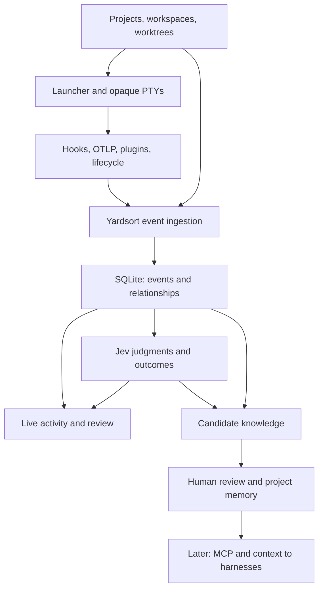

# Agent events and shared context for Yardsort

Status: **proposal; stages 0–1 implemented, stage 2 native capture done for the three harnesses named, and Grok besides** · 23 September 2026, fit pass 24 September 2026, Claude adapter 25 September 2026 · Target: public `docs/design`

> **Where this stands.** The current-state pass this document asks for was done on 2026-09-24 and is recorded in [10-agent-events-stage-1](10-agent-events-stage-1.md), together with the decisions and what shipped for stages 0 and 1 (roadmap [M11](05-roadmap.md#m11--agent-events-stage-01-)). Premises below that had drifted by then — the migration numbering, the number of built-in harnesses, `project_id` on events, the child environment — are corrected in that document rather than rewritten here. Stage 2's first adapter, Claude Code's hooks, shipped on 2026-09-25 and is recorded in [11-agent-events-stage-2-claude](11-agent-events-stage-2-claude.md) ([M12](05-roadmap.md#m12--agent-events-stage-2-claude-code-)); where it departs from the text below — no install and no uninstall, an inbox of files rather than a receiver process, no per-run token — that document says why. Codex followed the same day, in [12-agent-events-stage-2-codex](12-agent-events-stage-2-codex.md) ([M13](05-roadmap.md#m13--agent-events-stage-2-codex-)), and not the way the table below expected: neither its hooks nor OTLP, but its `notify` program as a trigger and its session file for the rest. OpenCode came last, in [13-agent-events-stage-2-opencode](13-agent-events-stage-2-opencode.md) ([M14](05-roadmap.md#m14--agent-events-stage-2-opencode-)), the way the table below hoped: a plugin, but given per launch and installed nowhere. Stage 2's exit gate — several live harnesses producing correctly linked events, missing capabilities honestly marked, telemetry failure never touching a run — is met for those three — and for Grok, which this document expected to stay lifecycle-only until a stable surface turned up: one did, its own metadata-only session log, in [14-agent-events-stage-2-grok](14-agent-events-stage-2-grok.md) ([M15](05-roadmap.md#m15--agent-events-stage-2-grok-)). Stages 3 on still stand as written.

## Summary

Add an optional, local structured activity layer beside Yardsort's existing PTY. It records what Yardsort itself knows about a workspace and harness process, and accepts richer events from harness-native telemetry when the user enables an adapter. The terminal remains the direct, unmodified harness interface. The first release offers a trustworthy activity timeline. Later releases can add reviewed project memory, cross-harness handoffs, evidence-linked review, and outcome-informed harness suggestions. Cloud sync is outside the initial scope.

This proposal borrows the _ideas_ of multi-source collection, normalized events, provenance, and reviewed memory from [Agent Beacon](https://github.com/Asymptote-Labs/agent-beacon). It does not require Beacon, copy its schema, or require an OpenTelemetry Collector. Yardsort adds information Beacon normally cannot own: the workspace, worktree, launch, resume/fork relationship, diff, and user decision. See [Prior art and licensing](#prior-art-and-licensing).

### Primary user story: Claude to Codex in one workspace

1. A user creates a Yardsort workspace and starts Claude Code in its worktree. Claude investigates and edits files, runs commands and discusses the approach with the user.
2. The user starts Codex in a **second terminal in the same workspace**. Codex already sees the same files and Git diff, but its conversation starts without Claude's goals, reasoning, failed approaches, test results or remaining work.
3. Yardsort should offer **“Start with workspace context”** or a similar explicit handoff action. It assembles the original goal when available, current branch/diff, selected recent activity and test/error evidence, plus a concise account of the prior session. The user previews and can edit the packet before it is sent to Codex through Yardsort's normal prompt transport. Claude may still be running; the packet is a timestamped snapshot, not live shared consciousness.
4. Later, approved project memory and a read-only Yardsort MCP tool let Codex request durable lessons and more session context on demand, with source links. A prompt-based handoff must still work when MCP is unavailable.

**Coverage limit:** Stage 1 knows Yardsort lifecycle and Git state, so it can show that Claude ran and what the workspace currently contains; it cannot reconstruct Claude's conversation or reasoning. Stage 2 captures the native events each harness actually exposes. Stage 4 turns available, permitted evidence into the handoff packet. Complete conversational continuity requires an opt-in content source or user-supplied summary and must clearly say when it is unavailable. Metadata-only telemetry cannot honestly generate “Claude tried A and rejected B.” Stage 5 memory is reviewed durable project knowledge; a one-off handoff uses session history and is useful before a memory engine exists.

## Current state and terminology

At Yardsort commit [`cb55ee1`](https://github.com/joaoh82/yardsort/tree/cb55ee1b8582e8cc6c223731bdda02e027803cf2), the v0.9.2 release (this is a snapshot, **not** a substitute for checking the branch when implementation begins — see [10 §1](10-agent-events-stage-1.md#1--current-state-at-the-start-of-the-work) for the state at `b502b1f`, where four more migrations, three more harnesses and the project run command had arrived):

| Existing object             | Source of truth                                         | Relevant fact                                                                                                                                                    |
| --------------------------- | ------------------------------------------------------- | ---------------------------------------------------------------------------------------------------------------------------------------------------------------- |
| Project, workspace, session | `crates/core/src/store.rs`, SQLite migrations 0001–0004 | `sessions` has workspace, harness, model, effort, optional initial prompt, `forked_from`, and live PTY ID. There is no first-class task/attempt table.           |
| Harness launch              | `crates/core/src/launch.rs`, `harness.rs`               | App and `ys` CLI share `Launcher`; launch labels include workspace and session record IDs. Harness definitions are user-configurable command/argument templates. |
| Terminal process            | `crates/pty-host` and `crates/pty-ipc`                  | The daemon owns PTYs over a local socket; it need not have a database. Its host events report Busy, Quiet and Exited. The app can reconnect.                     |
| Persistent data             | `crates/core/src/store.rs`                              | SQLite WAL supports app and CLI access. The daemon can outlive the window.                                                                                       |
| Review                      | `src-tauri/src/assist`                                  | Optional Jev checks assess diffs and suggest a harness from user-written strengths.                                                                              |

Changes since the initial `c55eba6` review are mostly frontend/release work: harness icons, update placement and documentation. The v0.9.2 changelog also records workspace-row waiting/exit indicators from the earlier commit. No new event-store migration or native telemetry layer appeared in this range. The latest [`docs/design/06-open-questions.md`](https://github.com/joaoh82/yardsort/blob/main/docs/design/06-open-questions.md) settles two relevant Assist decisions: current threshold defaults remain, and a future, narrow Jev evaluation of the visible screen on harness Quiet is intended. That screen proposal has unresolved privacy/opt-in details. `AGENTS.md` still says not to parse agent output. This feature must neither implement that screen exception accidentally nor assume it is already shipped; revisit the repository's current decision when coding starts.

Do not reinterpret `sessions.id` as a PTY or native harness ID. A **session record** represents one Yardsort harness conversation; one or more **process runs** can resume it, each with a distinct PTY ID. A fork creates another session linked by `forked_from`. A **workspace** is the current unit of parallel work, and may contain several conversations. A **task** and its competing **attempts** are proposed future objects; they must not be backfilled from titles or branches as if those were unambiguous intent.

### Principles and boundaries

1. **The terminal is the truth.** Do not parse PTY bytes to produce this feature's semantic events or make the harness UI depend on event collection. Existing Busy/Quiet status remains a heuristic for output activity, not proof of model thinking or waiting for approval. The separately proposed Assist visible-screen judgment is a narrow product decision that needs its own privacy design.
2. **Local and opt-in.** Yardsort-owned lifecycle events can be recorded locally. Native hooks, OTLP configuration, session-file readers, content capture and memory are separate user choices. No account or Yardsort server is required.
3. **Evidence over inference.** Every event identifies its source, collection method, native identity and confidence. Missing coverage is shown as missing coverage. A file's Git diff is not proof that a particular tool call changed a line.
4. **No critical-path dependency.** Telemetry cannot block PTY I/O, launch, prompts or approvals. All hook commands have short bounded execution and safe failure behavior.
5. **One durable product store initially.** Use Yardsort's SQLite for events and indexes. NDJSON export is optional; there is no second canonical log to reconcile. Raw harness session files remain owned by their harness.

## Target architecture



This is the same intended end-to-end capability as the earlier sketch, with **one canonical event store**. “Event ingestion” is a local normalization/dispatch interface, not a message broker or cloud service. The live UI subscribes to newly committed events and can query older ones from SQLite. A bounded daemon spool is temporary delivery/recovery for periods when the app is closed; it is drained into SQLite and is not a second queryable history. NDJSON is an explicit export format, not a concurrently maintained event ledger. The knowledge engine and MCP feedback loop arrive in later stages, after event capture and review are reliable.

The launch path creates a Yardsort `process_run_id` and correlation context **before** spawning. Pass only non-secret IDs through the `LaunchPlan` labels and child environment, e.g. `YARDSORT_RUN_ID`, `YARDSORT_SESSION_RECORD_ID`, `YARDSORT_WORKSPACE_ID`. Append to the process environment rather than clearing or rewriting the user's shell environment. If a harness strips environment variables, correlate with its verified native session ID and run interval; show unresolved events as unlinked, never attach by CWD alone when ambiguous.

The app and CLI already share `Launcher`, so instrument there for process start. A process may exit before the session row is inserted; preserve the existing settle-after-create behavior. Persist a pending run/correlation row before spawn and reconcile exit idempotently. The daemon sees lifecycle without keeping the UI open. There are two viable wiring steps: first persist lifecycle events from the app/CLI when reachable, then add a small versioned **semantic event frame** on the existing daemon socket for exits while the app is absent. Keep raw PTY frames untouched. A bounded daemon-side spool under Yardsort's data directory covers the window-closed interval; the core imports and acknowledges it on reconnect. Alternatively, let the daemon write these narrow events to SQLite after evaluating ownership and contention. The spool path is preferred because `pty-host` remains storage independent. Do not build native adapters in the daemon before this owner/crash boundary is tested.

The adapter receiver should live in the persistent process or a short-lived local service started with it, with a separate versioned local endpoint and same-user access rules as the PTY socket. The hook command may also append into a tightly scoped inbox file with atomic rename for the first prototype. Do not expose a public HTTP listener. A per-run random capability is preferable to trusting environment-provided IDs alone; avoid passing it in argv or logs. The receiver validates envelope size, rate and association and commits through a single ingestion worker. Native telemetry can continue while the window is closed.

## Event contract, v1

Use a small envelope with a versioned typed payload. Keep raw native payload out of the default database. Unknown event kinds remain preservable and exportable across minor upgrades.

```rust
struct AgentEvent {
    id: Uuid,                    // deterministic source key or assigned at ingestion
    schema_version: u16,         // starts at 1
    occurred_at_ms: i64,         // source clock, if supplied
    received_at_ms: i64,         // Yardsort clock
    project_id: String,
    workspace_id: String,
    session_record_id: Option<String>,
    process_run_id: Option<String>,
    native_session_id: Option<String>,
    parent_event_id: Option<Uuid>,
    kind: String,                // e.g. "process.started", "tool.completed"
    source: EventSource,         // harness/version, method, fidelity, native key
    payload_json: serde_json::Value,
    privacy_class: PrivacyClass,
}

struct EventSource {
    producer: String,            // "yardsort", "claude", "codex", "opencode"...
    producer_version: Option<String>,
    method: String,              // "lifecycle", "hook", "otlp", "plugin", "session_file"
    fidelity: String,            // "reported", "observed", "inferred"
    native_event_id: Option<String>,
}
```

Event families: `process.started|exited`, `session.resumed|forked`, `prompt.submitted`, `tool.started|completed|failed`, `command.completed`, `file.reported_read|reported_write`, `approval.requested|resolved`, `usage.reported`, `agent.subagent_started|stopped`, `workspace.changed`, and `evaluation.recorded`. `workspace.changed` means Git observed a diff, not that a specific agent wrote it. Version payloads per kind. `tool_call_id` and native trace/span IDs live in the relevant payload and can join a start to a result; they are nullable.

Ordering uses both clocks and a monotonic **ingestion sequence** assigned by SQLite. Display source time where sane, break ties with sequence, and label delayed imports. Do not assume arrival order equals action order across hooks and OTLP. Dedupe on `(source producer, native event ID, native session ID)` where present, otherwise a canonical hash of stable source fields plus run ID; the collision/ambiguity policy must be conservative. Repeated valid tool calls must survive dedupe. Store adapter warnings and dropped-event counters as diagnostics.

Default payload contains metadata (tool name, command status, relative path, duration, usage if reported). Do not persist prompt bodies, command strings/output, tool parameters, model responses or raw diffs by default. `sessions.prompt` already exists and must be covered by a separate migration/retention review; turning off the new collector does not erase that existing field. File paths may be sensitive; constrain displays/exports to project-relative paths when possible. Make content capture a later explicit setting with per-project retention and redaction; never collect environment variables, auth tokens or MCP arguments wholesale.

## SQLite design

Add migrations after the last shipped one (0004 at the snapshot; **0009** is what shipped, after 0005–0008 arrived in between); never edit shipped migrations. Initial tables (exact names may follow existing style; the ones that shipped are in [03-architecture](03-architecture.md#activity-runs-and-lifecycle-events)):

```sql
CREATE TABLE agent_runs (
  id TEXT PRIMARY KEY,
  session_id TEXT REFERENCES sessions(id) ON DELETE SET NULL,
  workspace_id TEXT NOT NULL REFERENCES workspaces(id) ON DELETE CASCADE,
  pty_session_id TEXT UNIQUE,
  native_session_id TEXT,
  started_at INTEGER NOT NULL,
  ended_at INTEGER,
  exit_code INTEGER,
  collection_status TEXT NOT NULL DEFAULT 'lifecycle_only'
);
CREATE INDEX agent_runs_by_session ON agent_runs(session_id, started_at);

CREATE TABLE agent_events (
  seq INTEGER PRIMARY KEY AUTOINCREMENT,
  id TEXT NOT NULL UNIQUE,
  schema_version INTEGER NOT NULL,
  project_id TEXT NOT NULL,
  workspace_id TEXT NOT NULL,
  session_id TEXT,
  run_id TEXT,
  native_session_id TEXT,
  occurred_at INTEGER NOT NULL,
  received_at INTEGER NOT NULL,
  kind TEXT NOT NULL,
  producer TEXT NOT NULL,
  method TEXT NOT NULL,
  fidelity TEXT NOT NULL,
  source_key TEXT,
  privacy_class TEXT NOT NULL,
  payload_json TEXT NOT NULL
);
CREATE INDEX agent_events_timeline ON agent_events(workspace_id, occurred_at, seq);
CREATE INDEX agent_events_run ON agent_events(run_id, seq);
CREATE UNIQUE INDEX agent_events_source ON agent_events(producer, source_key)
  WHERE source_key IS NOT NULL;
```

This is an **illustrative migration**: before coding, decide foreign-key behavior for archived/deleted workspaces and how an anonymous shell run is represented. SQLite writes stay short, batched, bounded and under the existing WAL/busy-timeout discipline; adapters must not hold a write transaction while waiting for a harness. Query by workspace/run with pagination, not `SELECT *`. Provide retention by age/size and explicit clear/export controls. Optional NDJSON export emits the public schema with privacy policy applied. Never automatically commit local event data into a Git worktree.

## Harness integration plan

Adapter capability is separate from `HarnessDef`'s argv templates. Built-in adapters can be selected by a stable built-in ID and compatible runtime version; arbitrary custom harnesses retain lifecycle-only support unless they explicitly supply an adapter. Disable an incompatible adapter without breaking launch. Preserve and compose user-managed settings; do not overwrite global harness configuration silently. Surface conflicts with Beacon or another OTLP exporter and provide a reversible uninstall/restore path.

| Harness                                 | First useful capture path                                                                                              | Caveats and fallback                                                                                                                                                                                                                                                                     |
| --------------------------------------- | ---------------------------------------------------------------------------------------------------------------------- | ---------------------------------------------------------------------------------------------------------------------------------------------------------------------------------------------------------------------------------------------------------------------------------------- |
| Claude Code                             | Opt-in native hooks for prompt/tool/permission/session lifecycle; optionally OTLP for usage and complementary signals. | Hook schemas/version and ordering vary. Chain existing hooks, bound runtime, and run fixture tests. Lifecycle-only if unavailable.                                                                                                                                                       |
| Codex CLI                               | Opt-in OTLP semantic logs and/or incremental read of its own session JSONL after version-specific fixtures.            | Current Beacon code uses Codex session-file collection as well as OTLP; OTLP alone does **not** guarantee per-file edits or every tool boundary. A Beacon Codex hook seen in source is `SessionStart` context, not full tool capture. Start with coverage actually observed in fixtures. |
| OpenCode                                | Opt-in managed plugin emitting tool lifecycle, usage and session metadata.                                             | Install only into a scoped/reversible config. Handle plugin version drift; lifecycle-only if unsupported.                                                                                                                                                                                |
| Grok and custom CLI                     | Yardsort process/workspace lifecycle initially; evaluate native hooks only if stable.                                  | No fabricated generic parser.                                                                                                                                                                                                                                                            |
| OMP, Cursor, Pi (built in since 0.10.0) | Lifecycle only; their `--help` shows plugin and hook-file mechanisms whose event coverage is unknown here.             | See the versioned matrix in [10 §6](10-agent-events-stage-1.md#6--stage-0-baseline-and-the-stage-2-coverage-matrix).                                                                                                                                                                     |

For OTLP, first test a minimal local receiver or a sidecar against the exact supported harness versions. Accept only logs/signals required by the adapter. Binding must be loopback/local, port conflicts handled, and existing user exporters preserved. A full OTel Collector distribution is a deployment cost to justify with measured need, not a prerequisite. For session-file collection, use cursors, partial-line handling, rotation/truncation detection, permissions and bounded reads. Do not claim that “all harness actions” are available; expose a coverage indicator per run.

### Correlation and correctness cases

- Launch through app and `ys`, resume into a new PTY for one record, fork into a new record, and start multiple same-harness runs in one workspace. Check every event associates to the correct run.
- Two workspaces sharing a repo; two harnesses active at once; unknown native session ID; delayed hook after exit; daemon upgrade with live processes; app crash/restart; daemon unavailable; disabled adapter.
- Hook duplicate, OTLP duplicate, out-of-order timestamps, malformed/oversized payload, clock skew, slow receiver, revoked permission, user edits to harness config, and an already-running Beacon install.
- Slow/full disk and SQLite busy: PTY must still run; diagnostics record loss. Avoid an unbounded in-memory queue.

## Product stages and exit gates

| Stage                    | Deliverable                                                                                                                                                                 | Exit gate                                                                                                                                                                                                                                                      |
| ------------------------ | --------------------------------------------------------------------------------------------------------------------------------------------------------------------------- | -------------------------------------------------------------------------------------------------------------------------------------------------------------------------------------------------------------------------------------------------------------- |
| 0. Baseline and fixtures | Document supported versions and real hook/OTLP/session-file samples; measure overhead, privacy and conflicts; agree on terminology.                                         | Public coverage matrix identifies exactly which events each adapter supplies.                                                                                                                                                                                  |
| 1. Yardsort lifecycle    | `agent_runs`, event schema/store, launch/resume/fork/exit events, timeline behind an experimental setting, diagnostics and retention. Daemon spool for window-closed exits. | App/CLI/restart/resume/fork tests pass on macOS, Linux and Windows; no PTY behavior regression. This stage needs no native harness config changes.                                                                                                             |
| 2. Native capture        | Claude first, then Codex, then OpenCode; opt-in reversible setup, dedupe, correlation and fixture suites.                                                                   | Multiple live harnesses produce correctly linked events; missing capabilities are honestly marked; telemetry failure does not affect a run.                                                                                                                    |
| 3. Review and provenance | Join event ranges to workspace diffs and Jev assessments; show evidence and uncertainty in a review panel.                                                                  | Review can distinguish reported writes from Git-observed changes; no claim of line-level causality without exact evidence.                                                                                                                                     |
| 4. Handoffs              | User-invoked context packet: task goal or initial prompt, workspace status, chosen event excerpts, tests/errors, diff summary, citations to event IDs.                      | In one workspace, start Claude, then launch Codex with a previewed/edited snapshot of available Claude and worktree context. Missing conversation content is labeled. Codex receives the packet through normal prompt transport; no automatic agent switching. |
| 5. Reviewed memory       | Candidate extraction, user approval/edit/reject, scoped project knowledge, local search and read-only MCP.                                                                  | Unapproved candidates never become agent instructions; revocation/update works; injection is opt-in.                                                                                                                                                           |
| 6. Outcome intelligence  | First-class task/attempt relations and measured outcomes, then optional suggestions using user strengths plus local history.                                                | Success labels distinguish explicit user choice/merge/test evidence from weak heuristics; small sample sizes do not imply a winner.                                                                                                                            |
| 7. Optional sync         | Only if user demand warrants: encrypted transport, identity, retention and conflict model.                                                                                  | Explicit design review; local operation remains complete offline.                                                                                                                                                                                              |

Stages are sequencing, not promised dates. Stages 3–6 can be reprioritized after observing real adapter coverage. Multi-agent scheduling and auto-merge deserve their own proposal: telemetry alone cannot make them safe.

### Jev's role

Jev is an **optional judgment component downstream of the event store**, not the collector, event bus, memory database or text generator. Preserve Yardsort's existing Assist behavior and key handling. Add typed judgments incrementally:

| Stage               | Proposed Jev input                                                                                    | Typed output and use                                                                                                                                                                              |
| ------------------- | ----------------------------------------------------------------------------------------------------- | ------------------------------------------------------------------------------------------------------------------------------------------------------------------------------------------------- |
| 3. Review           | Original user request (when available), final diff, test/check changes, selected event-derived facts. | Off-task change, weakened check, suspicious omission or review priority, each with evidence and uncertainty. Extend existing diff review rather than replace it.                                  |
| 4. Handoff          | Goal, recent outcomes/errors, current diff and candidate trace excerpts.                              | Rank which facts are useful in a handoff. A separate deterministic formatter or optional generation step writes the packet; the user reviews it.                                                  |
| 5. Memory           | A proposed claim, its source excerpts and scope.                                                      | Relevance, repeatability and possible contradiction as typed signals for the review queue. Jev does not author a memory or approve it.                                                            |
| 6. Outcomes/routing | Explicit user outcome labels, tests, rework, task type and past attempts.                             | Assess whether an attempt likely met the request and help rank harness/effort suggestions. Keep the user's written strengths, show sample counts, and never treat a Jev judgment as ground truth. |

The first two stages need no Jev calls. Existing Assist remains opt-in and uses the user's own key; event recording and timeline must work without it. No automatic “stuck” detection, harness switch or memory promotion is implied by a model judgment.

Keep the separately planned **Quiet-screen judgment** distinct from event ingestion. If that feature ships first, it may supply an explicit, labeled judgment such as “possibly awaiting permission” to the review/timeline, with opt-in and privacy controls inherited from Assist. Do not silently reinterpret screen text as tool calls or file writes. If it has not shipped, build the event feature without it.

## Beyond Beacon: where Yardsort has leverage

The first differentiated feature is **work-aware handoff**. Yardsort can package an actual worktree, branch, session lineage, current diff and test evidence alongside harness events. Second is **review with trace links**: a tool report and subsequent Git diff can be shown together with an explicit confidence label. Third is **outcome-informed choice**: once users can label an attempt's outcome, suggestions can use local evidence without assuming that token count or completion means quality. Fourth, later, is **task topology**: user-defined task and attempt relationships over several workspaces and harnesses. These are possibilities built on data Yardsort owns; they are not claims that today's repository already models all of them.

Memory belongs to a project scope first. A candidate records a concise claim, source session/event IDs, author (human or extractor), review state, applicability, expiry and revocation history. Optional directory and global scopes come after project-scoped behavior is reliable. An MCP read tool should return only approved entries with citations; it must defend against prompt-injection text from untrusted traces and must not let an agent approve its own candidate through a write tool by default. Store summaries only after explicit approval; use existing local search before adding embeddings. A generative extraction model is optional and requires separate consent/credentials; Jev's typed judgments can rank candidates but do not themselves draft prose.

## Performance, privacy and operations

Define measurable budgets in Stage 0: launch overhead, hook completion time, ingestion throughput under a burst, storage per hour of work, UI query p95, and event-loss counters. Start with a small bounded queue and batch SQLite inserts. Drop or defer telemetry under pressure, never terminal output. The running daemon's spool must have a size cap and atomic recovery; a full spool increments a diagnostic counter. Version the socket envelope independently of UI build and preserve old-daemon behavior during upgrades.

Settings should clearly show: lifecycle recording, each enabled adapter and its permissions, content capture, retention, export, clear, and whether any network destination is configured. There is no Yardsort network destination in Stages 0–6. Native harness OTLP settings may otherwise send data to a destination already configured by the user; setup should inspect and explain that interaction. Avoid persisting credentials and redact before any export. Deletion must cover SQLite events, daemon spool, derived indexes, review artifacts and memory while respecting the harness's own separately managed history.

## Prior art and licensing

Beacon's [repository](https://github.com/Asymptote-Labs/agent-beacon) and [MIT license](https://github.com/Asymptote-Labs/agent-beacon/blob/main/LICENSE) permit reuse under their terms. Yardsort is [`GPL-3.0-only`](https://github.com/joaoh82/yardsort/blob/main/LICENSE). This proposal is an independent Yardsort design citing Beacon as prior art; citing architectural ideas does not import Beacon code. If code, examples, or substantial schema text are copied later, keep the applicable MIT copyright and permission notice in the distribution, record the source commit/files in a third-party notice, and review individual vendored assets/dependencies and compatibility before merging. MIT permission does not grant trademarks. The design intentionally avoids claiming that Beacon Cloud's internal database or latency is known.

Sources reviewed: Yardsort [`docs/design/03-architecture.md`](https://github.com/joaoh82/yardsort/blob/main/docs/design/03-architecture.md), [`crates/core/src/launch.rs`](https://github.com/joaoh82/yardsort/blob/main/crates/core/src/launch.rs), [`crates/core/src/store.rs`](https://github.com/joaoh82/yardsort/blob/main/crates/core/src/store.rs), [`crates/pty-host/src/types.rs`](https://github.com/joaoh82/yardsort/blob/main/crates/pty-host/src/types.rs); Beacon [README](https://github.com/Asymptote-Labs/agent-beacon), [schema](https://github.com/Asymptote-Labs/agent-beacon/blob/main/docs/telemetry-schema/event-schema.mdx), [Codex collector](https://github.com/Asymptote-Labs/agent-beacon/blob/main/cli/beacon/cmd/endpoint_codex.go), [Claude hooks](https://github.com/Asymptote-Labs/agent-beacon/blob/main/cli/beacon/internal/endpoint/hooks/claude.go), and [license](https://github.com/Asymptote-Labs/agent-beacon/blob/main/LICENSE). Repository snapshots inspected at the commits named above and Beacon `b9c819b`.

## Implementation handoff

Start with **Stage 0 and Stage 1 only**. Re-read current migrations and launch/daemon code, decide and record the schema and ownership choices, then implement a small end-to-end lifecycle slice. Add a migration, shared Rust event types and store methods, a run ID at the shared Launcher, lifecycle writes on both app and CLI paths, window-closed exit delivery, a paginated debug timeline and diagnostics. Test resume/fork, app restart and telemetry failure without parsing PTY output. Record the exact event schema and coverage in public docs. Do not silently configure native hooks, start a cloud service, or implement memory until the lifecycle contract is demonstrably correct.

### Mandatory current-state and design-fit pass

This document was written against a point-in-time checkout. Before making code changes, the coding harness must:

1. Record the current branch, HEAD SHA, working-tree changes and recent commits. Fetch the latest relevant branch if network and access permit; do not overwrite unrelated local work. Read `AGENTS.md`, `CONTRIBUTING.md`, `README.md`, `CHANGELOG.md`, `docs/design/{03-architecture,04-harnesses,05-roadmap,06-open-questions}.md`, the relevant guides and this document. Compare the current state to the `cb55ee1` snapshot above.
2. Trace the **actual** app and `ys` launch, resume and fork paths; `sessions` migrations and store API; daemon lifecycle events, socket protocol and versioning; UI status/notifications; Assist/Jev inputs, caching and keys; harness settings and existing tests. Search for telemetry, OTLP, hooks, session-file readers, event storage, task/attempt entities and any in-flight branch or PR work. Do not assume they are absent just because they were absent at this snapshot.
3. Produce a short **fit report** before implementation: current architecture, recent changes that affect this feature, overlaps/conflicts with this design, revised file-level integration points, decisions on run/event ownership and recovery, and any changed stage order. Explicitly reconcile `AGENTS.md`'s no-output-parsing rule with the separate Quiet-screen Assist decision. Cite paths and line ranges or commits in the report.
4. Update this proposal if a premise is false. Prefer the current repository's established pattern over the illustrative table names, Mermaid arrows or pseudocode here. Preserve the product goals and explain any substantive departure. Never force a migration merely to match the sketch.

### Concrete Stage 0–1 work package

After the fit pass, implement a vertical slice that records Yardsort-owned lifecycle facts end to end. Suggested order:

- Add append-only migrations for runs/events, with explicit deletion/archival behavior, source keys, indexes and retention. Decide whether shell sessions receive a run row; avoid dangling references after workspace removal. Keep session-record ID, PTY ID, native harness ID and run ID distinct.
- Put types and event-store operations in the shared Rust core, reachable by both Tauri and `ys`. Assign correlation before spawn; handle spawn failure, process exit before record creation, resume into another process and fork into another record idempotently.
- Extend the daemon boundary only as much as needed to retain exit/lifecycle facts while no app window exists. Specify the spool's directory, permissions, size cap, atomic write/import/ack, duplicate handling, shutdown and protocol-version behavior. A simpler reliable alternative is acceptable if the fit report explains it. Never make PTY output wait on telemetry.
- Expose bounded, paginated workspace/run timeline queries through the established core/IPC pattern and a small experimental UI. Show source/fidelity and collection gaps. Do not imply Busy/Quiet equals semantic work state. If the frontend changes, update guide/README/changelog/design docs as `AGENTS.md` requires, including binding generation and screenshots when warranted.
- Add targeted tests that would fail without correlation and recovery: app and CLI launches, two concurrent sessions, resume, fork, immediate exit, window closed while a process exits, reconnect/import, duplicate delivery, corrupt/oversized input, a full spool or SQLite busy state. Use the repository's real PTY/process and temporary database conventions. Run the relevant focused suites, then the required project checks (`just check`, `just bindings-check`, and platform checks/CI where available). Report platform gaps rather than claiming unrun coverage.
- Publish a Stage 1 event/coverage contract and manual test notes. Do not imply `prompt.submitted`, tool calls, usage or file edits are captured in Stage 1: those require Stage 2 adapters and version-specific fixtures.

### Open design decisions to settle in the fit report

| Question             | Preferred starting point                                                   | Evidence that could change it                                                     |
| -------------------- | -------------------------------------------------------------------------- | --------------------------------------------------------------------------------- |
| Event write owner    | Core store for app/CLI; daemon only spools lifecycle when clients are gone | Existing daemon/store ownership changes or a simpler proven single-writer pattern |
| Store                | SQLite canonical; optional NDJSON export                                   | Proven performance/backup requirement that SQLite cannot meet                     |
| Native capture       | None in Stage 1; opt-in adapters with fixtures in Stage 2                  | A native integration already exists on the latest branch                          |
| `Task` and `Attempt` | Add only when user intent/outcomes need them in Stage 6                    | A current first-class task model with stable IDs already exists                   |
| Memory               | Human-approved project scope, later stage                                  | Validated existing memory model that meets provenance and revocation needs        |
| Jev                  | Optional downstream judgments, with current Assist behavior intact         | Current implementation has already expanded its contract                          |
| Quiet screen         | Separate Assist work; never a substitute for hooks/OTLP                    | A reviewed product decision explicitly joins it to this feature                   |

### Ready-to-paste kickoff prompt

The following prompt is intended for a coding harness with access to the Yardsort repository. Keep this document in its context throughout the work.

> You are working in the open-source Yardsort repository. Read `docs/design/09-agent-events-and-memory.md` in full. The intended product is a local structured agent-event layer beside opaque PTYs, followed in later stages by evidence-linked review, cross-harness handoff, reviewed project memory and optional Jev-based outcome judgments. SQLite is the initial canonical event store; NDJSON is an optional export. Preserve the existing app, CLI and daemon behavior, the local-first promise, and the user's data.
>
> **First, inspect the current state.** Record branch/HEAD/status and recent changes; fetch the latest relevant branch when available without losing local changes. Read `AGENTS.md`, `CONTRIBUTING.md`, current design/roadmap/open questions, the launch/store/daemon/IPC/Assist code, migrations, tests and relevant UI. Compare them with this document's `cb55ee1` snapshot. Identify any code or decisions added since then, particularly telemetry, task/attempt models and the planned Assist Quiet-screen judgment. Write a concise fit report with concrete paths, conflicts, revised integration points and decisions. Update the proposal where its assumptions no longer fit. Do not implement directly from stale pseudocode.
>
> **Then implement Stages 0 and 1 as a vertical slice.** Add versioned lifecycle events and process runs, persistent local storage, correlation through app and `ys` launches, reliable window-closed exit delivery, diagnostics, and a small experimental activity timeline. Preserve PTY bytes and input unchanged. A telemetry failure must not block or terminate a harness. Keep migration and daemon protocol compatibility, bounded storage and idempotent recovery. Do not configure Claude/Codex/OpenCode hooks or build Jev/memory/MCP features in this first slice. Record a realistic per-harness coverage matrix for Stage 2 based on fixtures or explicit unknowns.
>
> Verify real app/CLI launch, resume, fork, concurrent workspaces, early exit, app close/reopen, duplicate delivery and failure behavior with meaningful tests. Update all affected docs, changelog, bindings and user-facing guides under `AGENTS.md`; run `just check` and other applicable repository gates. If a platform cannot be exercised locally, state that limitation and supply a reproducible CI/manual verification step. Conclude with changed files, fit decisions, tests/results, remaining risks, and the next Stage 2 adapter slice. Continue through the first working vertical slice rather than stopping at a plan; ask only if an indispensable external decision or credential blocks the work.

For subsequent harness sessions, start from the fit report and current HEAD, then take **one** later stage or adapter at a time. Each stage should retain provenance, privacy and recovery invariants, update public documentation, and report its actual event coverage.
