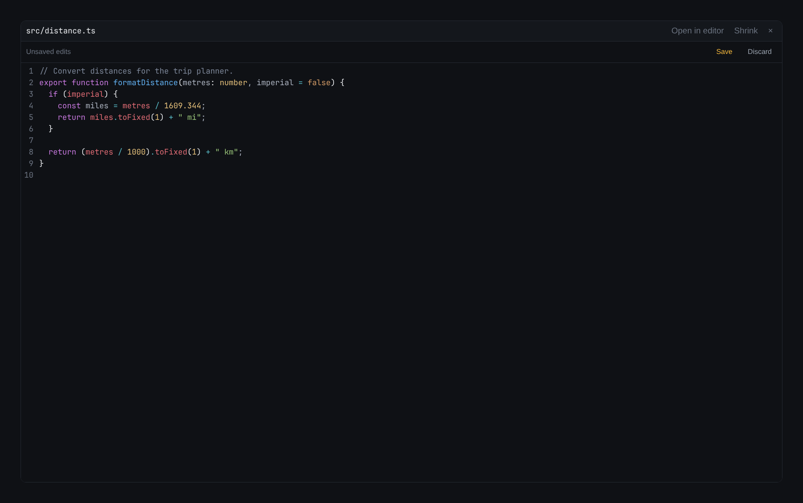

# Changes & files

The right panel is for **reviewing and editing** files in the selected workspace. It updates by
itself as files change — there is nothing to refresh. Toggle it with `Ctrl+Shift+Alt+B` / `⌥⌘B`.

## Changes

Two groups:

- **Uncommitted** — modified, added, deleted, renamed and untracked files in the working tree.
- **On this branch · vs `<base>`** — what the workspace's branch has committed since it left the
  branch it was started from. Shown for worktree workspaces; this is the view of "everything this
  agent did", whether or not it has committed yet.

Each row shows the kind of change (**M** modified, **A** added, **D** deleted, **R** renamed,
**U** untracked) and the lines added and removed. The tab shows the total count.

Click a file to see its **diff** below the list, with removed lines in red, added lines in green,
and the exact characters that changed highlighted within them. It starts **inline** — removals
folded into one pane — and **Side by side** puts the two versions in two panes instead, which is
easier on a wide diff. The choice sticks until you change it back.

| Button                        | Does                                                                          |
| ----------------------------- | ----------------------------------------------------------------------------- |
| **Side by side** / **Inline** | Two panes, or one with the removals folded in. Diffs only.                    |
| **Expand** / **Shrink**       | Give the viewer the whole panel, or go back to the split view.                |
| **Edit ↗**                    | Open the file in your editor — see [Settings → General](settings.md#general). |
| **×**                         | Close the viewer.                                                             |

PNG, JPEG, GIF, WebP, BMP and ICO images are previewed, with **Before** and **After** images
for changes. Other binary files and files larger than 1 MiB are listed but not rendered.
Use **Open file** on a diff to open the current working file for editing.

### Who wrote it

With any **Capture what … reports** switch on in [Settings → General](settings.md#general),
the list also shows what the workspace's agents _said_ they wrote. A changed file an agent
reported writing carries a small badge with that agent's name; hover it for how many times it
reported writing the file, when it last did, and through what (`claude/hook`, `codex/notify`,
…). A line above the list counts the files with such a report and the files without one — you,
a script, or an agent run that was not reporting — and the expanded viewer's header says the
same for the open diff: _reported by claude · 2 writes · 14:02_, or _no agent reported writing
this_.

Two things it never says. Which **lines** came from which report: git shows every change since
the last commit, and no agent reports a line, so a file you and the agent both touched carries
the agent's badge over the whole diff. And anything at all while **no** agent run in the
workspace was reporting: then every file is unreported for the same reason, and the list reads
as above.

A solid badge means the agent used a **file** tool — Claude Code's `Write` or `Edit`, Codex's
patch, and so on — and reported the file. A file the agent made with a **shell command**
(`echo hello > hello.txt`) cannot be reported, because a command names no file and Yardsort
never reads the command. For those there is a **dashed** badge: the file's own modification
time fell inside that command's run on the timeline, so it was last written _while_ the agent
ran it. Hover it for the words: the time on the file was read, not who wrote it — you or a
script could have written it in that window. A report always outranks this, and only a tool
call counts as a window, never the agent merely being open; so with no _Capture_ switch on,
nothing is marked. A file you edit after the agent made it carries your time and no badge.

A report that says the change failed — Codex says so for a patch that did not apply — is not
counted. Grok's log names the tools it ran and never the file, so a Grok run counts as reporting
and its commands' windows still mark files, but no file of its is ever reported. See
[Activity](activity.md) for what each agent reports.

### Assist badges

With [Assist](assist.md) switched on, files carry small badges — **off-task**, **secret**,
**tests**, **checks**, **credentials** — shortly after an agent stops writing, and a line above
the list says when they were last checked. Assist is off by default and needs an API key of your
own. A further switch tells Assist what the badges above say about who wrote each file, and adds
an **unaccounted** badge for a substantive change no agent accounted for; every Assist badge's
tooltip then ends with the exact sentence Assist was told.

## Files

The workspace's folder as a tree. Click a folder to open it, a text or code file to edit it with syntax
highlighting and undo/redo. **Save** writes your edits to the working file; it does not stage
or commit them. **Discard** reloads the disk version after asking you to confirm that your
unsaved edits can be lost. **Edit ↗** still opens your external editor.

Image files open as previews. SVG files start with a preview; **Edit source** opens their text,
and **Preview** switches back. Text editing and image previews are limited to 1 MiB per file.
Non-UTF-8 files are treated as binary so editing cannot corrupt their encoding.

Drafts are kept in the app's local profile, including across files, workspaces, expanding or
closing the viewer, and app restarts. They do not change the working file until you press
**Save**. If an agent or another editor changes the file, your draft stays visible and saving
refuses to overwrite that newer version. Copy any edits you want to keep, then **Discard**
the draft to reload the disk version. Save errors keep the draft too. Git internals and symbolic
links cannot be saved from this editor. Symbolic links show an explanation instead of opening
an editor. Read-only files must be made writable before saving; a failed save keeps both the
draft and the original file permissions.

While a draft is reopening, the panel says it is loading until the disk version arrives. Missing,
non-text and unreadable files have their own messages; only a different loaded text version is
reported as a conflict. Reloading from disk or discarding a draft clears the editor’s undo history
so Undo cannot restore an older disk version. Mixed image/text changes show both the preview
and the text.

By default the tree shows what git would: `.git`, and everything ignored by `.gitignore` —
`node_modules`, build output, `.env` files — is left out, which keeps a big repository quick to
browse. Press **ignored** at the right of the tab bar to show those too; they appear dimmed so you
can tell them apart. The choice is remembered.

## Sending the work on

Under the list are the three steps that get a workspace's work out: commit, push, and open the
pull request. See [Commits & pull requests](commits-and-pull-requests.md).

Diffs themselves stay read-only. Yardsort will not stage part of a change or discard one — do
that the way you already do, with a shell tab (`Ctrl+Shift+T`), your editor or your git client.
The workspace is an ordinary git checkout at the path shown in the footer.

## Show a file in the file explorer

Right-click a file or folder in **Files**, or a file in **Changes**, and choose **Show in file
explorer**. Yardsort asks your system's file manager (Finder on macOS, Explorer on Windows) to
reveal it. If the file has been deleted, its nearest existing parent folder opens instead.
Paths outside the workspace, including symlinks pointing outside it, are refused. Press
**Escape** or click elsewhere to dismiss the menu.
