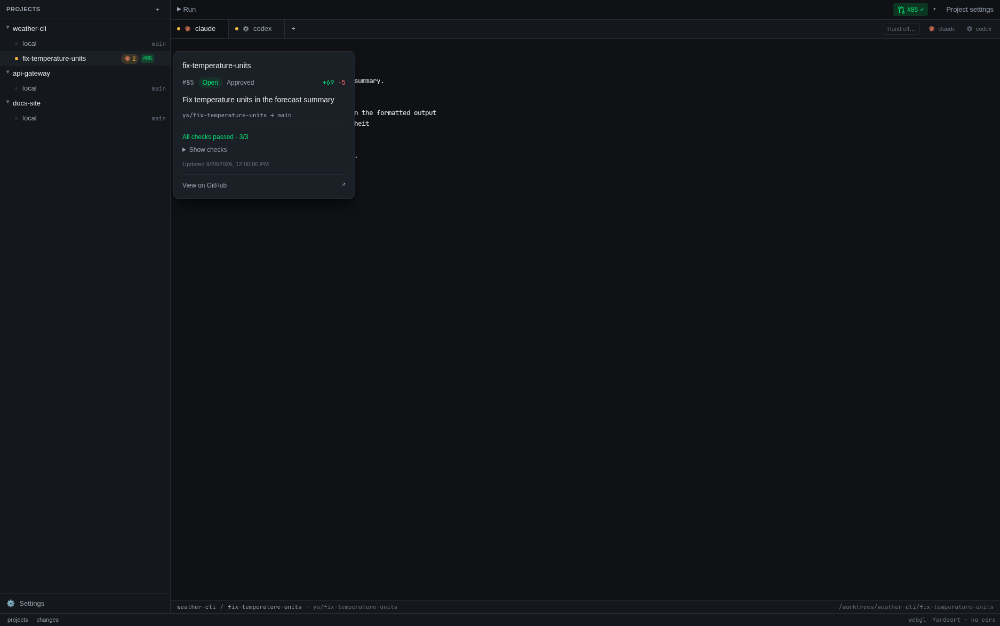
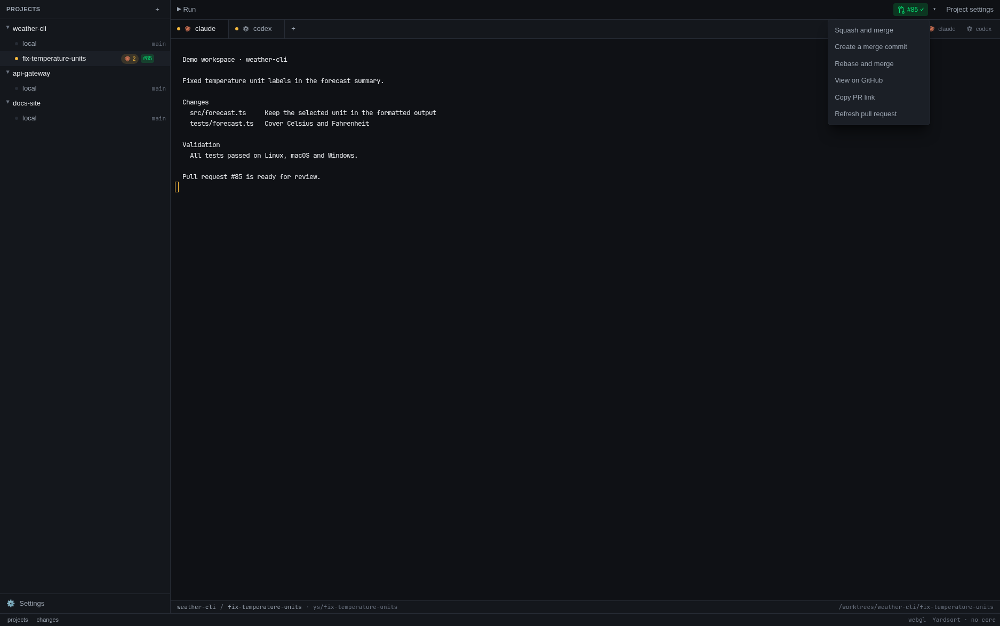

# Commits & pull requests

Commit reviewed workspace changes, push the branch and open a GitHub pull request from the foot
of Yardsort's [changes panel](changes-and-files.md). Review the diff before committing;
each action uses the selected workspace's repository and branch.

Everything here is ordinary git and, for the pull request, the
[GitHub CLI](https://cli.github.com). Nothing is stored, no account is created, and Yardsort
never holds a credential of its own.

This page is about the pull request a workspace opens. For every pull request of every project —
a teammate's, or one you want to start an agent on — see [Pull requests](pull-requests.md).

## Commit

When a workspace has uncommitted changes, a message box appears under the list with a
**Commit N files** button beside it. Type a message and press it — or press Enter in the box.

**Every commit is confirmed first**, naming how many files it takes, the message, and the branch
they land on. There is no exception for a branch that looks safe: the project's own `local`
checkout is usually sitting on `main`, and a rule with an exception is one you have to learn.

**It commits everything**, including files git has not seen before. There is no way to leave one
out, on purpose: a partial commit you did not ask for is a worse surprise than one more file than
you expected. If you need to split a change, use a shell tab (`Ctrl+Shift+T`) or your git client;
the workspace is an ordinary checkout at the path in the footer.

The message is passed to git as a single argument, so a message beginning with `--` is a message,
not an option.

If git has no name and email configured, the button stays disabled and says so rather than
failing halfway. Set them once:

```sh
git config --global user.name "Your Name"
git config --global user.email "you@example.com"
```

### Have it written for you

A **✦** sits beside the message box. Press it and a model writes the message from the diff you
are looking at — and from what the workspace was asked to do, which is what turns "describe this
change" into "explain it".

What comes back goes **in the box**, for you to read and edit. It is never committed for you; the
confirmation still stands between it and git.

The box takes a full message: Enter makes a new line, and `Ctrl+Enter` / `⌘Enter` commits.

Two things can do the writing, tried in that order:

1. **The agent you already have**, in its non-interactive mode — `claude --print`, `codex exec`,
   `opencode run`, `grok --single`, `omp --print`, `pi --print`. It is installed, logged in and billed to the account it
   already uses, and it is the agent this workspace has been working with. A harness you added
   yourself needs its **Write** arguments filled in under Settings → Harnesses before it can.
   Cursor is excluded from drafting because its print mode has no verified way to avoid saving
   a chat, which could replace the conversation opened by Resume. A Cursor workspace uses
   another available writer, or the API-key fallback below.
2. **Your own Anthropic API key**, when no configured agent can write. Add it under
   Settings → Assist; `ANTHROPIC_API_KEY` from your environment works too.

Switch the whole thing off under Settings → Assist if you would rather not be offered it. With no
agent able to write and no key, the ✦ does not appear at all.

## Push

**Push N commits** appears when the branch is ahead of the remote — of its upstream once it has
one, and of the base branch before the first push. It pushes to `origin`, or to the only remote
if there is no `origin`, and sets the upstream the first time so that later pushes are ordinary.

The push is never forced. Yardsort can only ever add to what the remote already has.

Credentials are git's: your SSH key, or whatever credential helper you already use. Yardsort
runs git with prompts disabled, so a push that needs an answer nobody can see fails with git's
own message instead of hanging.

One branch is never pushed from here: a workspace
[started from a fork's pull request](pull-requests.md#from-a-fork). Its branch follows the pull
request, and a push would create a new branch on your project's remote rather than update the
fork. The panel shows no **Push** there and says why.

## Open a pull request

**Open pull request** — **Open merge request** on GitLab — asks for a title, a description and
whether it should be a draft, then opens it.

The same **✦** is here, above the fields: it writes the title and the description together, from
everything the branch has committed. As with a commit message, it fills the fields in and leaves
them to you.

Without pressing it, the form starts filled in from the commits the remote has not got yet. The
oldest becomes the title. For the description:

- **One commit** — its own message body, everything under the subject line. That commit _is_ the
  pull request, so a well-written one needs no second write-up. It is what `gh pr create --fill`
  does too.
- **Several** — a list of their subjects, oldest first, in the order they happened.

Both are a starting point; edit either before pressing the button.

**It pushes first if it needs to.** A branch the forge has never seen cannot have a pull request,
and a button that fails and tells you to press a different one is not worth having.

### With `gh`

If the [GitHub CLI](https://cli.github.com) is installed and logged in, the pull request is opened
from here and your browser lands on the finished thing. `gh` keeps your GitHub credentials, in the
place you already manage and revoke them; Yardsort never asks for a token of its own.

```sh
gh auth login    # once, if you have not already
```

### Without it

Everything still works, one step longer: the branch is pushed and your browser opens the forge's
own "open a pull request" form with both branches already filled in. Finish it there.

This is the path for GitHub, GitLab, Bitbucket, Gitea and Forgejo alike, and for a self-hosted
host Yardsort has never heard of — it assumes GitHub's URL shapes, which the Gitea family uses
too. A remote that is a path on disk is not a forge, so the button does not appear at all.

## On the workspace row

Once a workspace has a pull request, its number appears on its row in the sidebar, coloured by
its status. The toolbar button, its dropdown arrow and the preview use the same colours:

| On the row         | Means                                                                                |
| ------------------ | ------------------------------------------------------------------------------------ |
| **#42**, green     | Open with no pending or failing status. CI may have passed or may not be configured. |
| **#42**, yellow    | Draft, checks running, or review required.                                           |
| **#42**, red       | At least one check failed, changes were requested, or it has merge conflicts.        |
| **merged**, purple | Merged. The workspace can be archived or deleted.                                    |
| **closed**, red    | Closed without merging.                                                              |

For open PRs, failures, requested changes and merge conflicts take precedence over pending
statuses. Green does
not claim that CI ran: the preview says **No checks reported** when no result is available, and
the toolbar only shows a success tick when checks actually passed. Hover or keyboard-focus a
workspace row to preview its pull request: number, title, state, head and base branches, review
decision, added and removed lines, check summary, and last update time. **Show checks** expands
the individual check names and results. You can move the pointer into the card to use it;
Escape dismisses it. From a focused trigger, Arrow Down moves into the card's controls.
Clicking a row or its menu dismisses the preview without reopening it through mouse focus.
If `gh` has not answered successfully, the workspace preview shows its name and branch without
claiming that no PR exists.

**Press the badge to open the pull request in your browser.** It sits beside the row rather than
on it, so pressing it opens the pull request while pressing the row still opens the workspace. The
same summary sits at the right of the panel foot for the selected workspace, and does the same.

The workspace toolbar also shows the PR number and check status, and **⚠** when GitHub reports
merge conflicts. Hover or focus it for the same details, or use its arrow menu for **View on
GitHub**, **Copy PR link**, and **Refresh pull request**. A merged or closed PR stays visible
until another PR replaces it on that branch. When a branch has several PRs, an open one takes
precedence; otherwise Yardsort shows the newest.

### A workspace with several pull requests

One workspace can open more than one pull request: a second PR on the same branch after the first
merged, or an agent that split its work and opened a PR from another branch it created there. The
badge stays the PR for the branch the workspace has checked out, and the rest are counted beside
it — **#42 +2** on the row, **+2 ▾** on the toolbar's arrow. Hover the row to see them listed
under _Also opened from this workspace_, each with its own badge to open it. In the toolbar, the
arrow menu lists them all with a tick on the one shown; choose another and the toolbar, its
preview and every action in the menu are about that one until you switch back or leave the
workspace.

Which PRs count as the workspace's comes from git, not from guessing at names. Each worktree keeps
its own record of what its `HEAD` has been (its reflog), so Yardsort counts a PR when:

- its branch is the one the workspace has checked out — what the badge has always shown;
- its branch was checked out in this workspace before the PR was opened (for the branch the
  workspace was created on, that is from its creation);
- its head commit was made in this workspace, whatever the branch is called on GitHub; or
- the workspace was [started from it](pull-requests.md#start-a-workspace-from-a-pull-request)
  and it comes from a fork, in which case git's own configuration of the branch says which pull
  request it follows.

The time matters because branch names get reused: a PR opened on `ys/fix` by a workspace you
deleted last month is not this one's, even if this one is also on `ys/fix`. Git keeps that record
for 90 days by default, so a PR older than that is still found only through the branch the
workspace is on.

**This needs `gh`.** Without it there is no number and no check result anywhere in the app, and
nothing complains about that: it is a supported way to use Yardsort, not a fault. Logged out of
`gh`, or a repository `gh` does not recognise, is the same — no badges, no error. If you were
expecting numbers and there are none, the pull request dialog says what `gh` actually replied.

Yardsort asks the forge once per project, not once per workspace, and reuses the answer for half
a minute. It asks again when you come back to the window, every minute while it is open, and
straight after anything you do that changes the answer. What it asks for is the newest fifty pull
requests; every _open_ one is read as well when Yardsort starts and while the
[Pull requests](pull-requests.md#how-often-github-is-asked) view is open, so a workspace whose
open pull request has fifty newer ones in front of it still gets its badge. That pull request is
also asked about by itself every minute while the view is closed, so its checks and its merge
show up as soon as they would for any other. The pull request link in the Changes panel follows
the same answer.



## Merge a pull request

The toolbar menu offers **Squash and merge**, **Create a merge commit**, and **Rebase and merge**
for an open, non-draft PR. Each asks for confirmation naming the PR and both branches. Cancelling
leaves it alone. The merge uses `gh` and your existing GitHub permissions; repository restrictions
still apply. A failure appears beside the toolbar with GitHub's explanation.

Yardsort checks the PR again and merges only the head commit shown when you confirmed. If someone
pushes another commit meanwhile, refresh and review it before trying again. The workspace and
local branch are kept.

Yardsort does not pass `--auto`. On a branch without a required merge queue, unmet requirements
cause the command to fail and the toolbar shows the reason. For branches that require a merge
queue, the [GitHub CLI](https://cli.github.com/manual/gh_pr_merge) handles queueing: it adds eligible
PRs to the queue, or enables auto-merge while required checks are pending. The toolbar reports
that the request was sent and refreshes the status, rather than claiming it has already merged.
You can refresh again from the menu.



## Resolve merge conflicts

When GitHub says an open PR conflicts with its base, the toolbar's arrow menu offers **Ask its
agent to resolve conflicts…**. It hands the work back to the agent that opened the PR, which
already knows the task and the code, instead of leaving you to merge by hand.

Which agent: the conversation that was running in this workspace when GitHub says the PR was
opened. If none was, the one the workspace's task was first given to; failing that, the newest
conversation there. A confirmation names it, and says how the request will reach it:

- **Running and quiet** — the request is typed into its tab and sent, as if you had typed it.
  Anything you had typed there and not sent yet goes with it, as part of the same message:
  Yardsort cannot see what is in an agent's input, so clear it first if it matters.
- **Ended** — the conversation is resumed in a new tab and the request typed in once it is ready.
- **Cannot be continued** (its agent can only resume its latest conversation, say) — a new
  conversation of the same agent starts, given the request and the workspace's task. It is listed
  as _Resolve conflicts in #42_.

The request names the PR, its branch and its base, and asks the agent to fetch the base, merge it
into the branch, resolve each conflict keeping what both sides meant, run the project's checks,
commit and push. It is told **not to rebase or force-push**, so the PR's history and its review
comments stay where they were, and to stop and ask you when a conflict needs a decision it cannot
make from the code and the task.

Cancelling the confirmation sends nothing. A few things stop it before anything is sent, and say
why beside the toolbar:

- **The agent is working.** Yardsort never types into a busy agent; ask again once it is quiet.
- **GitHub changed its mind.** The PR is asked about again first. If it no longer conflicts, or
  GitHub has not finished working that out after a push, nothing is sent.
- **No agent has worked here**, or its agent is no longer configured or is disabled.
- **The PR is not one this workspace opened** — the list was out of date, say. Refresh and choose
  again.
- **The agent to ask changed after you confirmed.** GitHub's answer can point at a different
  conversation from the one the confirmation named; then nothing is sent, and asking again
  names the new one. Only the conversation you agreed to is ever asked.

GitHub works out whether a PR conflicts lazily, after a push to either branch, so the **⚠** and
the menu entry can take a minute to appear. **Refresh pull request** asks again.

## What it does not do

No CI logs, local rebasing or staging area. Those remain with the forge or your git tools; the
toolbar's rebase option is GitHub's PR merge method. A pull request's description, checks and
conversation are read in the [Pull requests](pull-requests.md#the-details) view, not here. Yardsort never resolves a
conflict itself: it asks the agent, which does it with git in the workspace like any other work.
