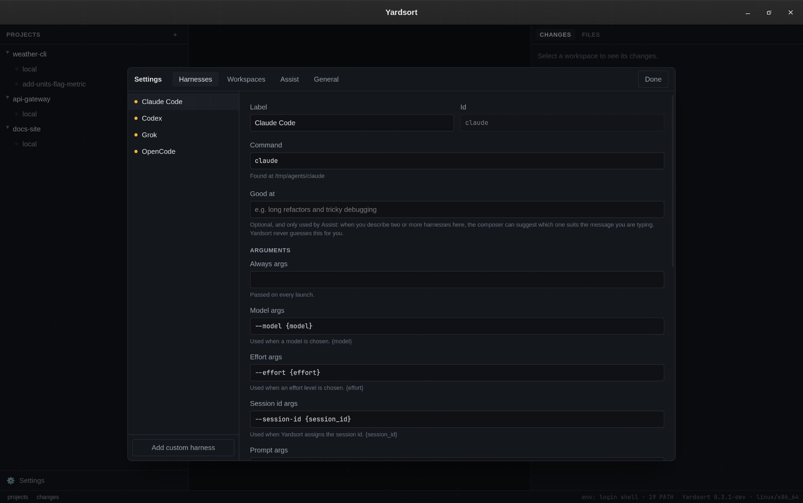

# Settings & harnesses

Open with the **Settings** button at the bottom of the left panel, or `Ctrl+Shift+,` / `⌘,`.

Settings are stored in a plain TOML file you can read, back up and edit:

| System  | Location                                                       |
| ------- | -------------------------------------------------------------- |
| Linux   | `~/.config/dev.yardsort.app/settings.toml`                     |
| macOS   | `~/Library/Application Support/dev.yardsort.app/settings.toml` |
| Windows | `%APPDATA%\dev.yardsort.app\settings.toml`                     |

If the file cannot be parsed, Yardsort says so, runs on defaults, and keeps your file as
`settings.toml.unreadable` instead of overwriting it.

## Harnesses

A **harness** is a coding agent that runs in a terminal. To Yardsort a harness is pure
configuration — a command and some argument templates — so any agent can be added without
waiting for a new release.

Built in: **Claude Code**, **Codex**, **Grok**, **OpenCode**. The dot next to each shows whether
its command was found on your `PATH`.

### Fields

| Field                | Meaning                                                                                                                                                                                                                                                  |
| -------------------- | -------------------------------------------------------------------------------------------------------------------------------------------------------------------------------------------------------------------------------------------------------- |
| **Label**            | The name shown in the app.                                                                                                                                                                                                                               |
| **Command**          | The program to run. It is looked up on the `PATH` of your login shell (so tools installed by mise, nvm, Homebrew or cargo are found), and the resolved location is shown underneath.                                                                     |
| **Always args**      | Passed on every launch — the place for flags you always want, such as a permission mode.                                                                                                                                                                 |
| **Model args**       | Used when a model is chosen, e.g. `--model {model}`.                                                                                                                                                                                                     |
| **Effort args**      | Used when an effort level is chosen, e.g. `--effort {effort}`.                                                                                                                                                                                           |
| **Session id args**  | Used when Yardsort assigns the conversation's id, e.g. `--session-id {session_id}`.                                                                                                                                                                      |
| **Prompt args**      | How the first message is passed, e.g. `{prompt}` or `--prompt {prompt}`.                                                                                                                                                                                 |
| **Resume args**      | Replaces the last two groups to continue a conversation, e.g. `--resume {session_id}`.                                                                                                                                                                   |
| **Fork args**        | Same, to fork one, e.g. `--resume {session_id} --fork-session --session-id {new_session_id}`.                                                                                                                                                            |
| **Models / Efforts** | Suggestions for the composer's pickers. Models accept free text regardless. Leave efforts empty to hide that picker.                                                                                                                                     |
| **Prompt transport** | **argv** passes the prompt as an argument — simple and reliable. **stdin** starts the agent first and pastes the prompt once it has been quiet for the given time — for agents with no prompt argument. Very long prompts switch to stdin automatically. |
| **Session id**       | **assigned**: Yardsort chooses the id, so any session can be resumed. **latest in folder**: the agent chooses, and only its most recent conversation in a workspace can be continued.                                                                    |
| **Good at**          | Optional, in your words: what this harness suits. Used only by [Assist](assist.md), to suggest a harness for the message you are typing. Yardsort never fills this in for you.                                                                           |
| **Enabled**          | Disabled harnesses stay configured but are not offered.                                                                                                                                                                                                  |

### How arguments work

- Arguments are split like a shell would split them (quotes group words), **but no shell is
  involved**. Each argument reaches the program exactly as written, and a placeholder's value is
  never split again — a prompt full of quotes, spaces and newlines is still one argument.
- Placeholders: `{prompt}` `{model}` `{effort}` `{session_id}` `{new_session_id}`.
- A group whose placeholder has no value is dropped whole: choose no model and no dangling
  `--model` is passed.

**What will run** at the bottom shows the exact command lines — start, resume and fork — for
sample values, updating as you type. **Test launch** starts the harness, unsaved changes included,
in a scratch terminal so you can see it come up.

### Restoring defaults

For a built-in harness only your _changes_ are saved, so improved defaults in a newer Yardsort
still reach every field you left alone. **Restore defaults** discards your changes.

### Adding your own harness

**Add custom harness**, give it an id, and fill in at least the command. If the agent can take a
first message, set _Prompt args_ (or the stdin transport); fill _Resume args_ / _Fork args_ if it
can continue conversations. Custom harnesses appear in the composer and the tab bar like the
built-in ones. **Delete** removes one.

## Assist

Optional AI help from TypeSafe's Jev model: badges on changed files, and suggestions in the
composer. It is off until you enter your own API key and tick a feature, and each feature says
exactly what it sends. The key is kept in your system credential store, never in this file.

See [Assist](assist.md) for the whole feature, including what happens when it is unavailable.

## Workspaces

| Setting             | Meaning                                                                                                                                                                                  |
| ------------------- | ---------------------------------------------------------------------------------------------------------------------------------------------------------------------------------------- |
| **Worktree folder** | New workspaces are created in `<folder>/<project>/<workspace>`. Default: `~/yardsort`. Must be an absolute path; keep it short on Windows, where deep paths hit the 260-character limit. |
| **Branch prefix**   | New branches are named `<prefix>/<workspace>`. Default `ys`. Empty means no prefix.                                                                                                      |

Both apply to workspaces created from now on; existing ones stay where they are.

## General

| Setting                              | Meaning                                                                                                                                                                           |
| ------------------------------------ | --------------------------------------------------------------------------------------------------------------------------------------------------------------------------------- |
| **Editor command**                   | What **Edit ↗** runs — `code`, `cursor`, `zed`, … It is given the workspace folder and then the file. Empty tries `cursor`, `code`, `zed`, `windsurf`, `subl` and `idea` in turn. |
| **Check for updates automatically**  | Looks for a newer release shortly after starting and once a day. On by default. **Check now** looks immediately and shows the version you are running. See [Updates](updates.md). |
| **Notify me when an agent finishes** | Desktop notifications when a busy agent goes quiet while you are in another window. On by default.                                                                                |

## Environment variables

For testing and unusual setups:

| Variable                 | Effect                                                                                                                                                                                                                               |
| ------------------------ | ------------------------------------------------------------------------------------------------------------------------------------------------------------------------------------------------------------------------------------ |
| `YARDSORT_DATA_DIR`      | Keep the database **and** `settings.toml` in this folder — a throwaway profile. Each one gets its own [background process](terminals-and-sessions.md#agents-keep-working-when-you-close-the-window), so its agents are separate too. |
| `YARDSORT_WORKTREE_ROOT` | Override the worktree folder.                                                                                                                                                                                                        |
| `YARDSORT_NO_DAEMON`     | Run terminals inside Yardsort, as it did before v0.4: they stop when it closes.                                                                                                                                                      |
