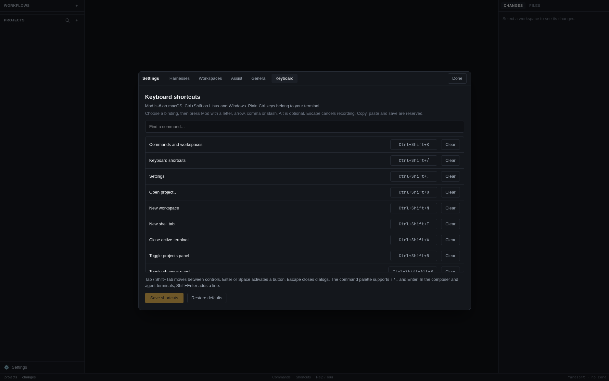

# Keyboard shortcuts

Open **Shortcuts** in the bottom bar, or **Settings → Keyboard**, for the in-app cheat sheet and binding editor.

**Mod** is `⌘` on macOS and **`Ctrl+Shift`** on Linux and Windows.

| Shortcut      | Linux / Windows      | macOS       | Action                                                                                              |
| ------------- | -------------------- | ----------- | --------------------------------------------------------------------------------------------------- |
| Mod+K         | `Ctrl+Shift+K`       | `⌘K`        | Search commands and workspaces                                                                      |
| Mod+/         | `Ctrl+Shift+/`       | `⌘/`        | Shortcut cheat sheet and configuration                                                              |
| Mod+L         | `Ctrl+Shift+L`       | `⌘L`        | Focus projects (expands the panel)                                                                  |
| Mod+E         | `Ctrl+Shift+E`       | `⌘E`        | Focus the workspace or active terminal                                                              |
| Mod+R         | `Ctrl+Shift+R`       | `⌘R`        | Focus changes and files (expands panel)                                                             |
| Mod+↑ / Mod+↓ | `Ctrl+Shift+↑` / `↓` | `⌘↑` / `⌘↓` | Previous / next usable workspace                                                                    |
| Mod+← / Mod+→ | `Ctrl+Shift+←` / `→` | `⌘←` / `⌘→` | Previous / next terminal tab                                                                        |
| Mod+O         | `Ctrl+Shift+O`       | `⌘O`        | Open a project (folder picker)                                                                      |
| Mod+N         | `Ctrl+Shift+N`       | `⌘N`        | New workspace in the current project                                                                |
| Mod+T         | `Ctrl+Shift+T`       | `⌘T`        | New shell tab in the selected workspace                                                             |
| Mod+W         | `Ctrl+Shift+W`       | `⌘W`        | Close the active tab                                                                                |
| Mod+B         | `Ctrl+Shift+B`       | `⌘B`        | Toggle the left panel                                                                               |
| Mod+Alt+B     | `Ctrl+Shift+Alt+B`   | `⌥⌘B`       | Toggle the right panel                                                                              |
| Mod+,         | `Ctrl+Shift+,`       | `⌘,`        | Settings                                                                                            |
| Mod+C / Mod+V | `Ctrl+Shift+C` / `V` | `⌘C` / `⌘V` | Copy the selection / paste, in a terminal ([more ways](terminals-and-sessions.md#copy-paste-links)) |

In the composer: `Enter` starts, `Shift+Enter` adds a line, `Esc` cancels. `Esc` also closes
dialogs and menus. In an agent's terminal `Shift+Enter` adds a line too — see
[Typing to an agent](terminals-and-sessions.md#typing-to-an-agent).

## Navigate without the mouse

**Commands** in the bottom bar or **Mod+K** opens a searchable palette of commands and
workspaces. Type to filter, use ↑ / ↓ to select and Enter to run; Escape closes it. Commands
that do not apply to the current workspace are disabled. Some commands have no key until you give
them one — [Pull requests](pull-requests.md), [Tasks](tasks.md), [Usage](usage.md) and the welcome tour among them — and are always here. Workspace navigation follows project
order, wraps at either end, and skips archived or missing workspaces and missing projects.
Opening a worktree follows the same behavior as clicking its row, including opening a shell
when it has no terminal or conversation to return to.

Use **Mod+L**, **Mod+E** and **Mod+R** to reach the three panels. Tab / Shift+Tab moves between
controls, and Enter or Space activates buttons. In the project and file trees, ↑ / ↓ moves
between rows, → expands, ← collapses or goes to the parent, and Home / End jumps to the ends.
Tab reaches the action buttons beside a project or workspace. On a terminal tab, **Shift+F10**
(or the keyboard's context-menu key) opens its menu. Settings tabs support ← / → and Home / End.

Dialogs keep keyboard focus inside them and return it when closed. Global app shortcuts pause
while a dialog or menu is open, including during shortcut recording. Plain terminal keys remain
with the running program. Modified arrows in text fields (including the composer, commit
message, search inputs and editable code) keep their normal caret movement and selection behavior.
They do not switch workspaces or terminals while you edit. Other shortcuts, including Mod+K,
remain available in text fields. A focused terminal still uses Mod+arrows for app navigation.
Disabled commands leave their keys unconsumed.

## Customize bindings

In **Settings → Keyboard**, filter the command list, select a binding and press the new
combination. Use Mod with a letter, arrow, comma or slash; Alt is optional. Escape cancels
recording. **Clear** leaves an action unassigned; it stays available through the command palette.
Duplicate bindings are explained and cannot be saved. C, V and S are reserved for copy, paste
and file saving. Terminal/composer keys such as Shift+Enter are fixed.

Press **Save shortcuts** to apply changes. **Restore defaults** prepares the standard bindings;
press Save to apply those too. Bindings are saved in the profile's SQLite UI state and survive
restarts. If saving fails, the previous bindings remain active and the error is shown. Button
hints and the palette reflect saved bindings. The bottom-bar Shortcuts button remains available
if you clear the shortcut that opens this screen.

Saved bindings take precedence over defaults added by a newer version. If a new default
conflicts with your shortcut, the new command stays unassigned and remains in the palette.
Keyboard settings explains any recovered bindings: invalid individual entries use an available
default; duplicate saved entries keep the first command in the cheat sheet and leave the later
one unassigned. Unrelated custom bindings and explicitly cleared bindings are preserved. If the
saved data cannot be read as a command map, defaults are used with a notice. Review and press
**Save shortcuts** to keep recovered bindings and clear the notice; loading never overwrites the
stored data automatically.

## Why Ctrl+Shift?

Because plain `Ctrl`+letter belongs to the program in the terminal. `Ctrl+B` moves back a
character in a shell and is the tmux prefix; `Ctrl+W` deletes a word; `Ctrl+T` transposes;
`Ctrl+C` interrupts. An app that takes those away makes its terminal worse than a real one.
`Ctrl+Shift` is what terminal emulators have always used for their own commands, so Yardsort
does too. On macOS `⌘` never reaches the terminal, so it is free to use.

Shortcuts follow the character your keyboard layout produces, not the physical key, so they match
the key caps on Dvorak, AZERTY and friends.
