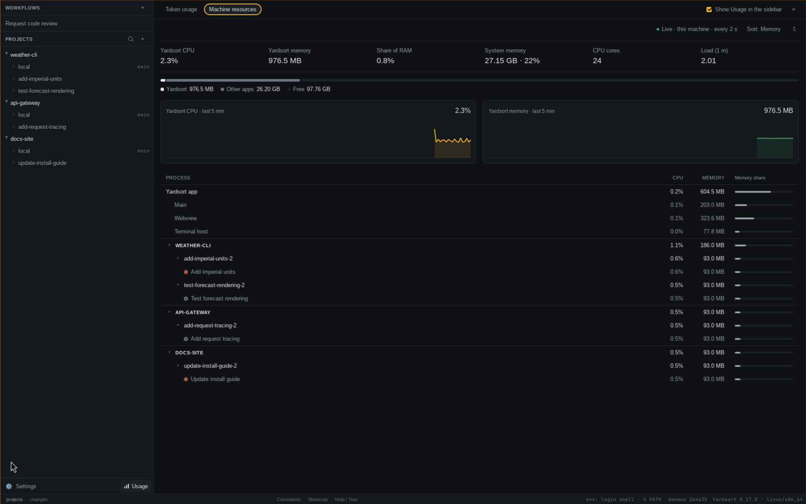

# Usage

**Usage** answers two questions: how many tokens have my agents spent, and what are Yardsort and
its agents using of this machine right now? Open it with **Usage** at the foot of the sidebar,
beside **Settings**, or from the [command palette](shortcuts.md#navigate-without-the-mouse)
(**Mod+K**, then _Usage_). It takes over the center panel the way a workflow does; **×** in its
header closes it, and so does selecting a workspace.

It has two tabs, **Token usage** and **Machine resources**. Usage remembers the tab you last looked
at until you quit.

Nothing here is sent anywhere. Token figures come from files the agents keep on this machine,
and machine figures from the operating system.

## First look

1. Open **Usage** and choose **Token usage**. It starts with the last **30d** in **Cost**;
   choose **7d** or **90d** for a different range, or **Tokens** to compare token counts.
2. Check the sources listed above the totals. These are Claude Code, Codex and Grok's own
   logs, including work you started outside Yardsort. No additional API key or
   [activity capture](activity.md) is needed.
3. Hover a daily bar, inspect **By model**, then use **By workspace** to find where the tokens
   went. Click a known workspace to return to its terminal.
4. Choose **Machine resources** to find what is using CPU or RAM now. Switch **Sort: Memory**
   to **Sort: CPU**, expand a project or workspace, and inspect its terminals.

The token tab covers three agents; the machine tab covers all terminals Yardsort runs, including
other agents, shells and run commands. Neither tab includes agents running on another computer.

## Token usage


### Where the figures come from

Each agent keeps a log of its own conversations, with the tokens of every model call. Yardsort
reads those files where they are and never changes them:

| Agent       | Where its logs are                                                                                            | What one entry is                     |
| ----------- | ------------------------------------------------------------------------------------------------------------- | ------------------------------------- |
| Claude Code | `projects/` in `CLAUDE_CONFIG_DIR`, else in `~/.claude` (and `~/.config/claude`, where some installs keep it) | One API call                          |
| Codex       | `sessions/` and `archived_sessions/` in `CODEX_HOME`, else in `~/.codex`                                      | One model response                    |
| Grok        | `sessions/` in `GROK_HOME`, else in `~/.grok`                                                                 | One turn, split by model where it was |

The variables are read from the same environment your agents are started in, so the folders are
the ones they actually use. A line under the tabs lists each agent found, where, and how many log
files it has.

This counts **every** conversation those agents had on this machine — started in Yardsort or in a
terminal of your own — that is still present in the logs. Deleted logs cannot be counted.
It knows nothing of other machines. Other agents (OpenCode, OMP, pi, Cursor) are not counted yet,
even when their events appear in the Activity timeline.

Claude Code writes a reply once per part of it, and a resumed conversation copies earlier replies
into its new file, so each call is counted once by its own ids. Codex releases before
`token_usage_record` only wrote running totals; those are counted by how much each total grew.

The logs are read when the tab opens, when you change the range, and when you press **↻**. Files
that have not changed since the last read are not read again, and files last written before the
range starts are not opened at all.

### Cost

**Cost** is an estimate: what the same tokens would have cost billed per token at each vendor's
published API rate. It is marked with **\*** for that reason. If you use a subscription — Claude
Max, ChatGPT Pro, SuperGrok — you are not billed this way, and this is not what you pay; it is a
way to compare agents, models and workspaces with one unit.

The rates are built into this version of Yardsort, from Anthropic's and OpenAI's price lists:
input, output and cache reads per model, and for Claude, cache writes at 1.25× input for the
five-minute cache and 2× for the hour-long one. A model whose price is not known — every Grok
model, for now, and anything newer than this release — has its tokens counted and its cost left
out, shown as **—**, and named under the total as _Not priced_. A near match is never used:
`gpt-5.4-pro` is not priced as `gpt-5.4`.

### What is on the tab

- **Plan limits.** Codex writes its plan's rate limits into its log each time its vendor tells it:
  the plan, how much of each window is used, and when the window resets. They are shown as Codex
  last heard them — _as of 3h ago_ — and a window that has reset since says so. Claude Code and
  Grok do not write theirs down, so they are not shown; the section is headed **Plan limits** and
  says so.
- **Range and unit.** **7d**, **30d** and **90d** cover the last seven, thirty or ninety days,
  today included, in your time zone. **Cost** and **Tokens** switch the total, agent shares,
  daily bars and workspace figures between US dollars and tokens. The token breakdown keeps
  its token counts, cache savings stays in dollars, and the model table shows both units.
- **The total and each agent's share**, beside a bar for each day with the agents stacked in it.
  Hover over a day for each agent's figure and the day's total.
- **Processed tokens** — everything: input of every kind, and output. **Cached input** is input
  read from a prompt cache, with its share of all input. **Cache writes** is input written to one
  (Claude only; the others do not charge for it separately). **Uncached input** is the rest.
  **Output** includes reasoning. **Cache savings** is what reading from the cache saved against
  paying full input price for the same tokens.
- **By model**, most expensive first: cost, share of the cost and tokens. **All →** lists every
  model when there are more than eight; **Show fewer** collapses the list again.
- **By workspace.** A call is put in the Yardsort workspace whose folder it ran in — the deepest
  one, so a worktree inside a project's folder is its own. Click one to open it. A folder Yardsort
  does not know is listed by its name; hover for where it is. The list sorts by the selected
  unit, and offers **All →** when there are more than eight entries.

When no logs are found at all, the tab says where it looked.

If figures seem missing, check that the source folders match your agent's environment, widen
the range, and press **↻** after the agent has written its latest usage. Token usage refreshes
on those actions rather than continuously. A **—** cost means an unknown price, not zero tokens;
switch to **Tokens** to include those models in comparisons. Plan limits are the last record
Codex wrote, rather than a live query to your account.

## Machine resources



While this tab is open, Yardsort samples every two seconds; while it is closed, or the window is
hidden, nothing is sampled. **↻** samples at once.

- **Yardsort CPU** is a share of the whole machine — every core counted, so it never passes 100 %.
  **Yardsort memory** is resident memory. Both include the app, its terminal host and every
  terminal it runs, with everything those started.
- **Share of RAM**, **System memory** (in use, and as a share of all of it), **CPU cores**, and
  **Load (1 m)** — the one-minute load average. Windows has no load average; it shows
  **System CPU** instead.
- The bar beneath splits memory into Yardsort, other apps and free.
- Two charts show samples of Yardsort's CPU and memory from the last five minutes. Hover for
  a moment's figures. This is a live view, not a saved history of resource use while Usage was closed.

The table breaks Yardsort down:

- **Yardsort app** — **Main** is the app's own process; **Webview** is the processes below it that
  draw the window; **Terminal host** is the [background process](terminals-and-sessions.md) that
  keeps terminals alive, without the terminals.
- Then each **project** with something running, each **workspace** in it, and each **terminal**:
  a conversation by its title, else the agent's name, a shell as _Shell_ and a run command as
  _Run command_. A terminal's figures are its whole process tree — the agent and every program it
  started, such as a test run or a language server — so nothing is counted twice. Hover a terminal
  for how many processes that is. The arrows collapse a project or a workspace; click a workspace's
  name to open it.
- Terminals in no workspace are listed last, under **Other terminals**.

**Sort** switches the order between memory and CPU.

Memory is summed over processes, as every task manager does, so pages that several processes
share are counted once for each. On macOS the processes that draw web content belong to the
system rather than to Yardsort, so **Webview** there shows little or nothing.

## Hiding Usage from the sidebar

**Show Usage in the sidebar**, at the right of the Usage header, takes the button off the foot of
the sidebar, or puts it back. The command palette offers Usage either way. The choice is kept in
`settings.toml`:

```toml
[usage]
show_in_sidebar = false
```
