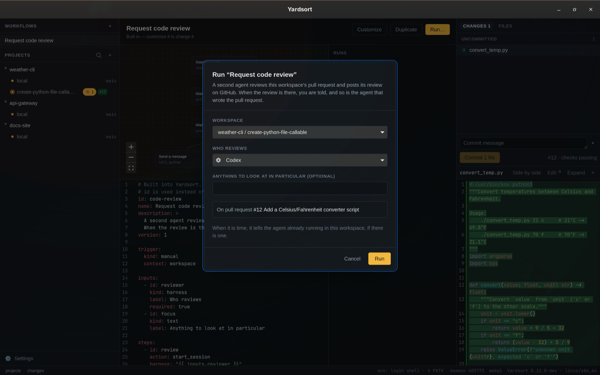

# Workflows

A workflow is a named, reusable piece of agent work that runs in steps. For example: have a second
agent review this workspace's pull request, then tell me and the agent that wrote it. You write
one as a short YAML file. Yardsort checks every name and every `{{ variable }}` in it before it
runs anything, and names the line and column of each mistake.

Workflows have their own section at the top of the sidebar. Open one to see its steps as a chart,
edit its file, and follow its runs; **Run…** starts it. `ys workflow run` starts one from a
terminal, with Yardsort open, because the app is what carries runs out.

## The Workflows section

**Workflows**, above **Projects** in the sidebar, lists every workflow: the built-in ones and
yours, by name. A number on a row is how many of its runs are going now; a red **!** means the file
has problems and cannot run; an orange dot means unsaved changes. Click a row to open it in the
center panel. **+** starts a new one.


The center panel shows three things:

- **The chart.** Every step as a box, top to bottom, with an arrow from each step to the ones
  that need it. Steps that need the same ones sit side by side. The chart is drawn from the file
  and follows it as you type. Click a box (or focus it and press **Enter** or **Space**) to select
  that step and scroll the YAML editor to its highlighted `id` line, including in read-only
  built-ins. Click the chart background to clear the selection. With a run open in the list on the
  right, each box shows how that step went in it.
- **The file.** A YAML editor. Every pause in typing checks the file, and each problem is marked
  where it is and listed under the editor. A built-in is read-only: **Customize** copies it into
  your folder under the same id, so your copy is used instead of it, and **Duplicate** copies it
  under a new id, as a second workflow. Your own file has **Save**, **Revert** while there are
  unsaved changes, **Duplicate**, and **Delete**, or **Reset to built-in** for a copy that
  replaces one, which deletes your copy and brings the built-in back. Deleting asks first.
  Unsaved changes are kept while Yardsort is open, so you can look at another workflow and come
  back; they are gone when it quits.
- **Runs.** This workflow's runs, newest first, with the workspace and when each was asked for.
  Open one for its steps, what each left or why it failed or was skipped, and the pull request it
  is about. A run still going has **Cancel run**.

**Run…** opens a dialog. It asks for the workspace and for each of the workflow's inputs; an agent
is picked from the same list as the composer's, with those not installed greyed out. If the
workflow works with the pull request, the dialog looks it up and shows it, or says why there is
none to use. It also says what the run would find nothing for: a prompt that uses
`{{ workspace.task }}` in a workspace started without a first message, `{{ memory }}` in a
project that does not share it, or `{{ workspace.base_branch }}` on the default branch, which is
based on nothing. Those are notes, not refusals; the line renders empty. The run starts when you
press **Run**, and appears at the top of the runs at once.



A workspace's menu has **Run workflow…**, which opens the same dialog for that workspace, and
**Request code review…**, which opens it on the built-in review.

**+** in the sidebar starts a new workflow from a short example, with every part a file needs.
Give it an `id` and **Save**: it is written as `<id>.yaml` in your folder, and never over a file
already there.

**Or describe it.** A new workflow has a box above the editor: say what it should do, in your own
words, and press **Write it**. The agent you already have writes it, in its non-interactive mode,
or your Anthropic API key does. Choose **Settings → Assist → Workflow writer** to use Claude
Code, Codex, or any installed, enabled harness with **Write args**, including a custom harness.
**Automatic** chooses the first installed writer; the optional Anthropic key is the fallback
when no agent can write or an agent fails. An explicitly selected writer that becomes unavailable
is reported: install or enable it, configure its Write args, or choose another writer. This
preference is saved across restarts and only applies to workflow files. The enable switch is
shared with
[having a commit message written](commits-and-pull-requests.md#have-it-written-for-you). The
model is told the file format and shown the built-in review as an example. What it writes is
checked like any file; when it has problems it is sent back once, with them, and whatever comes
back goes into the editor unsaved, with anything still wrong marked where it is. Nothing a model
wrote is a workflow until you save it. The agent runs in an empty repository of the profile's
own, never in one of your projects; a repository because some agents will not run outside one.

## Where workflows come from

- **Built in.** Yardsort ships with one: **Request code review** (`code-review`). A second
  agent, one you pick, reviews the workspace's pull request in the same worktree and posts its
  review on GitHub with `gh`. When the review is on the pull request, you get a notification, and
  the agent that wrote the pull request is told once it is not busy. See
  [Requesting a code review](#requesting-a-code-review). `ys workflow show code-review` prints the
  whole file.
- **Yours.** Every `.yaml` or `.yml` file in the `workflows` folder of Yardsort's data directory.
  [Where Yardsort keeps things](troubleshooting.md#where-yardsort-keeps-things) says where that
  is on your system, and `ys workflow list` prints it.

A file with a built-in's `id` is used instead of that built-in. That is how you change one:

```sh
ys workflow copy code-review                       # your copy, used instead of the built-in
ys workflow copy code-review --as careful-review   # or a second workflow beside it
```

`copy` writes the file into your folder, prints where, and never overwrites a file that is
already there. Edit the copy, then check it with `ys workflow validate`. Delete the file and the
built-in comes back. If your copy has a mistake, it is listed with its problems and does not run.
The built-in does not quietly run in its place.

Use `copy` rather than redirecting `ys workflow show` into the folder. The shell creates the
empty file before `ys` runs, so `ys` finds that empty file under the built-in's id and prints
nothing useful. Windows PowerShell's `>` also writes UTF-16, which is not a workflow file.

If two of your files have the same `id`, the first by file name is used. The other is listed with
a problem saying which file it clashes with.

Workflows only come from your own folder, never from a project's repository. A workflow decides
what is sent to your agents. A repository you cloned should not get to decide that.

## An example

```yaml
id: fix-tests
name: Fix the failing tests
description: An agent runs the tests on this workspace's branch and fixes what fails.
version: 1

trigger:
  kind: manual

inputs:
  - id: fixer
    kind: harness
    label: Who fixes it
    required: true

steps:
  - id: fix
    action: start_session
    harness: "{{ inputs.fixer }}"
    prompt: |
      Run this project's tests on `{{ workspace.branch }}`. Fix what fails, and commit the fix.

      {{ memory }}

  - id: done
    action: wait_session
    needs: [fix]
    session: "{{ steps.fix.session }}"
    timeout: 1h

  - id: tell_me
    action: notify
    needs: [done]
    title: "{{ workspace.name }}: the tests are fixed"
```

Steps run as soon as every step in their `needs` has succeeded, so steps can run side by side.
`tell_me` waits for `done`, and `done` waits for `fix`. Two steps that both need `done` would run
together.

## Running a workflow

**Run…** on the workflow, or **Run workflow…** in a workspace's menu, asks the same questions as
the command line and starts the run. From a terminal, with Yardsort open, because the app is what
carries runs out in the background while you keep working:

```sh
ys workflow run fix-tests --workspace fix-login --input fixer=claude
```

`--workspace` takes a workspace's name or id. Run it inside a workspace's folder, or in an
agent's terminal there, and it can be left out. Give each input as `--input id=value`. `ys`
checks everything before anything is queued:

- the workflow is ready to run
- the workspace is there and not archived
- every required input is given, there are no inputs the workflow does not ask for, a `choice` is
  one of its options, and an agent named by a `harness` input or a step is set up in Yardsort and
  on your `PATH`
- a workflow that uses the pull request has one to use: the branch the workspace has checked out
  has an open pull request on GitHub, found with the GitHub CLI (`gh`), which must be installed
  and logged in. Its number, link and title are kept with the run.

Optional inputs left out take their `default`, or are empty. A workflow runs once at a time in a
workspace: asking again while it runs is refused, naming the run. With Yardsort closed, `ys` says
so and queues nothing. When the run would find nothing for a variable the file uses — the task
of a workspace started without a first message, say — `ys` says so in a note after queuing, and
the Run dialog shows it before; the run goes ahead either way.

`ys workflow run` prints the run's id and returns at once. The app picks the run up within a
second, and moves each step on as soon as it can: every second, and the moment an agent goes
quiet or ends. To follow it:

```sh
ys workflow runs                  # every run, newest first
ys workflow runs --run 3f2a9c1e   # one run, step by step, with why a step failed or was skipped
ys workflow cancel 3f2a9c1e       # stop it
```

What each step does while it runs:

- **`start_session`** starts the agent exactly as the composer would, and it opens as a new tab in
  that workspace. The tab you were looking at stays in front. From then on it is an ordinary
  session: you can watch it, type to it, or close it.
- **`wait_session`** waits until the agent has **settled**: it has gone quiet after at least 8
  seconds of output, or its harness reported that it finished its turn. With `until: exited` it
  waits for the program to end. An agent that ends while it is waited on ends the wait too.
- **`send_to_session`** waits until the agent is quiet, then types the message and presses Enter.
  It looks again at the moment of typing, and never types into a busy agent. If the agent ends
  first, the step is skipped. `session: origin` is the workspace's own agent: its newest agent
  session that was running when the run started. A shell is not an agent, and neither is an
  agent the run starts itself. With none running then, the step is skipped, saying so.
- **`wait_pr_activity`** waits for a review or a comment, as `kind` says, posted on the pull
  request after the run started. It asks GitHub every 30 seconds, in the background, so a slow
  answer holds up no other step; a question GitHub has not answered within a minute is dropped
  and asked again.
- **`notify`** shows a system notification.

A step runs only when every step in its `needs` succeeded. When one fails, the steps after it are
skipped, and the run fails with that step's reason.

**Cancelling** stops the run. Agents it started keep running as ordinary sessions: close them as
you would any other.

**If Yardsort quits during a run,** the run carries on when you open it again. A step that was
waiting keeps waiting. A step Yardsort was in the middle of, such as starting an agent, fails
saying so rather than being done twice. An agent that settled while Yardsort was closed is only
noticed if its harness reported the finished turn.

## Requesting a code review

The built-in **Request code review** has a second agent review a workspace's pull request, then
tells you and the agent that wrote it. With the workspace's branch pushed and a pull request open
on GitHub:

```sh
ys workflow run code-review --workspace fix-login --input reviewer=codex
```

Add `--input focus="…"` for anything to look at in particular. What happens:

1. The reviewer starts in the same worktree, as a new tab. It is told the pull request, the task
   the workspace was started with, and to read and run but not edit, since the author works in
   the same folder. It posts its review with `gh pr review`, putting findings on the lines they
   are about.
2. When the reviewer has settled and its review is on GitHub, you get a notification.
3. At the same time, the agent that wrote the pull request, if it is still running in the
   workspace, is told the review is there once it is quiet, with the link, and asked to address
   it, push, and answer each comment.

GitHub does not let the author of a pull request approve it or request changes. When the reviewer
posts as the same GitHub account as the author, as it does when both use your `gh` login, it is
told to post its review as comments.

To change the prompts or the timeouts, `ys workflow copy code-review` and edit your copy.

## The file

| Key           | What it is                                                                                                               |
| ------------- | ------------------------------------------------------------------------------------------------------------------------ |
| `id`          | Lowercase letters, digits and `-`, like `fix-ci`. Name the file after it.                                                |
| `name`        | What the workflow is called in lists.                                                                                    |
| `description` | Optional. One or two sentences.                                                                                          |
| `version`     | `1`. A file with a later version is listed but not run, and says to update Yardsort.                                     |
| `trigger`     | `kind: manual`: you start it. Optional `context: workspace`, the default and the only one: a run is about one workspace. |
| `inputs`      | Optional. What you are asked before a run starts.                                                                        |
| `steps`       | At least one.                                                                                                            |

Keys a workflow does not have are mistakes, not ignored. A misspelt `promt:` is reported, not
silently skipped.

### Inputs

| Key        | What it is                                                                                                |
| ---------- | --------------------------------------------------------------------------------------------------------- |
| `id`       | Starts with a lowercase letter; then lowercase letters, digits, `_` and `-`. Used as `{{ inputs.<id> }}`. |
| `kind`     | `harness` (one of your agents), `text`, or `choice`.                                                      |
| `label`    | Optional. The question. The `id` when left out.                                                           |
| `required` | Optional. `false` when left out. An optional input left empty is empty text wherever it is used.          |
| `default`  | Optional. For a `choice`, one of its options.                                                             |
| `options`  | For a `choice` only: the answers to pick from.                                                            |

### Steps

Every step has an `id`, named the same way as an input, and an `action`. `needs` is optional: the
steps that must finish first. A step cannot need itself. Steps that wait for each other in a
circle are reported, because none of them could ever start.

| Action             | Keys                                                             | What it does                                                                                                                                                                                                                     |
| ------------------ | ---------------------------------------------------------------- | -------------------------------------------------------------------------------------------------------------------------------------------------------------------------------------------------------------------------------- |
| `start_session`    | `harness` (required), `prompt`, `model`, `effort`, `skip_memory` | Starts an agent in the workspace, like the composer does, with `prompt` as its first message. It opens as a tab there. `harness` is an agent's id, like `claude`, or exactly `{{ inputs.<id> }}` for an input of kind `harness`. |
| `wait_session`     | `session` (required), `until`, `timeout`                         | Waits for a session. `until: settled`, the default, means it has gone quiet after at least 8 seconds of output, or its harness reported a finished turn. `until: exited` means the program has ended.                            |
| `send_to_session`  | `session` (required), `prompt` (required), `timeout`             | Types `prompt` into a running session. It waits until that session is quiet: a busy agent is never interrupted. If the session is gone, the step is skipped.                                                                     |
| `wait_pr_activity` | `kind`, `timeout`                                                | Waits for a new review or comment on the workspace's pull request, since the run started. `kind` is `review`, `comment` or `any`, the default.                                                                                   |
| `notify`           | `title` (required), `body`                                       | Tells you, with a system notification.                                                                                                                                                                                           |

A key that belongs to another action is reported as misplaced. `title` on a `start_session` step
is an example.

**`session`** is `origin`, meaning the agent already working in the workspace when the run started, or
`"{{ steps.<id>.session }}"` for a session an earlier `start_session` step started. That step
must be among this step's `needs`, directly or through another step.

**`timeout`** is a whole number and a unit: `30s`, `45m`, `2h`. At most a week. A step that runs
out of time fails.

### Variables

Any text in a step can use `{{ name }}`. Only these names exist. A name is a dotted path and
nothing else: no filters, no expressions. Anything else is reported where it is written.

| Variable                                                                                          | What it is                                                                                                                                                                                                                                             |
| ------------------------------------------------------------------------------------------------- | ------------------------------------------------------------------------------------------------------------------------------------------------------------------------------------------------------------------------------------------------------ |
| `project.name`, `project.root`                                                                    | The project, and the folder of its own checkout.                                                                                                                                                                                                       |
| `workspace.name`, `workspace.branch`, `workspace.base_branch`, `workspace.path`, `workspace.task` | The workspace the run is about. `task` is the first message it was started with. In the project's own checkout, `branch` is whatever git has checked out, and `base_branch` the repository's default branch, unless that is the branch itself.         |
| `pr.number`, `pr.url`, `pr.title`                                                                 | The open pull request for the workspace's branch, found when the run is queued.                                                                                                                                                                        |
| `inputs.<id>`                                                                                     | What was given for that input.                                                                                                                                                                                                                         |
| `steps.<id>.<field>`                                                                              | What an earlier step left: `session` and `run` from `start_session`, `outcome` from `wait_session`, `count` and `latest_url` from `wait_pr_activity`. The step must be among this step's `needs`.                                                      |
| `memory`                                                                                          | The project's [memory](memory.md), as an agent is given it, when the project shares it. Empty otherwise. An agent's first message gets the memory after it anyway; put `{{ memory }}` in a `start_session` prompt to have it there instead, not twice. |
| `handoff`                                                                                         | The workspace's [handoff](terminals-and-sessions.md#handing-work-to-another-agent) packet: what happened there so far.                                                                                                                                 |

To write `{{` literally, for example in a prompt about a template language, write `\{{`.

## Checking a file

`ys workflow validate <file>` checks a file without needing Yardsort to have run on this machine.
It prints each problem as `file:line:column: message` and exits 1 if there are any:

```text
$ ys workflow validate fix-tests.yaml
fix-tests.yaml:20:36: `{{ workspace.brnch }}`: `workspace` has no `brnch`. It has `name`, `branch`, `base_branch`, `path`, `task`.
fix-tests.yaml:26:13: There is no step `fx`. Did you mean `fix`?
fix-tests.yaml:27:15: `{{ steps.fix.session }}` is used before step `fix` is sure to have run. Add `fix` to this step's `needs`.
```

That is the example above with `workspace.branch` misspelt and `needs: [fix]` written `[fx]`.

`-` reads the file from standard input. `--json` prints `{ valid, id, problems }`.

`ys workflow list` shows every workflow, whether it is ready to run, and where it comes from.
`ys workflow show <id>` prints the file that would be used, with any problems after it. See
[the `ys` command line](cli.md#ys-workflow).
