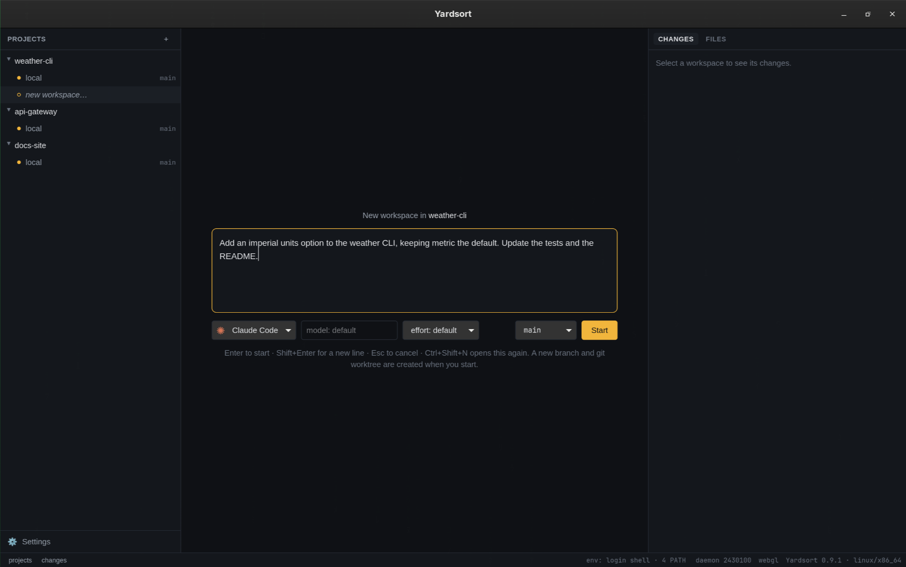

# Workspaces

A **workspace** is one line of work inside a project: a git branch, checked out in its own folder
(a [git worktree](https://git-scm.com/docs/git-worktree)), with the terminals running in it.
Because each workspace has its own folder, agents working in parallel never step on each other —
or on you.

Workspaces are plain git. Everything Yardsort does you can inspect with `git worktree list` and
`git branch`, and nothing stops you using those folders from any other tool.

## Starting one: the composer

Press **+** on a project row, or `Ctrl+Shift+N` / `⌘N` for the project you are in.

| Field       | What it does                                                                                                                                                      |
| ----------- | ----------------------------------------------------------------------------------------------------------------------------------------------------------------- |
| **Message** | The agent's first prompt. `Enter` starts, `Shift+Enter` makes a new line. Leave it empty to just open the agent. Drop a file here to insert its path — see below. |
| **Harness** | Which agent to run. The list comes from [settings](settings.md).                                                                                                  |
| **Model**   | Free text with suggestions. Empty means "let the agent use its default" — no flag is passed at all.                                                               |
| **Effort**  | Offered only for agents that have the concept.                                                                                                                    |
| **Branch**  | Under _New branch from_, pick the branch to start from. Under _Open existing branch_, pick a branch to check out in a workspace as it is — no new branch is made. |

Under the pickers, **Import worktrees…** opens the same dialog as the project menu, for worktrees
that already exist — see [Worktrees made elsewhere](#worktrees-made-elsewhere).

Your last choices are remembered per project. With [Assist](assist.md) switched on, a line under
the pickers may offer a harness and an effort for what you are typing; **Use** applies it, and
ignoring it does nothing.

**Drop a file on the composer** to put its path in the message, at the cursor, so the agent starts
already pointed at it. Drop several and each path is added, separated by spaces. The composer is
outlined while the file is over it. The path is written as plain text in the prompt, and one that
contains a space is quoted. The same gesture on a
[terminal](terminals-and-sessions.md#typing-to-an-agent) pastes the path into a program that is
already running, quoted for the shell.

**Nothing is created until you press Start** —
cancelling (`Esc`) leaves no trace.

On Start, Yardsort:

1. names the workspace from your message (`Add a --units flag…` → `add-units-flag`), making it
   unique if needed;
2. runs `git worktree add` with a new branch, `ys/add-units-flag` by default;
3. starts the agent there with your message.

Naming looks for an explicit task in the message, including after introductory background:
`I've been looking at the settings screen. Could you please add dark mode?` becomes
`add-dark-mode`. It skips fenced code and common request lead-ins, then keeps up to four words
and 32 characters. This is local text extraction, not an AI summary; unrecognized wording falls
back to the opening words. Empty or unusable messages get a railway station name. Names are
chosen when the workspace is created; later messages do not rename it.

If preparation or the agent launch fails, the worktree and its branch are kept, so script output
and copied files remain available. The error names its folder. Fix the problem and open the
workspace to start an agent, or delete it through the workspace menu if it is no longer needed.

### Where the folders go

`~/yardsort/<project>/<workspace>` by default. Change the folder and the `ys/` branch prefix in
[Settings → Workspaces](settings.md#workspaces). Changing them affects new workspaces only.

### Files git does not track

A fresh worktree contains what is committed — so `.env` files, `node_modules` and other ignored
or untracked things are **not** there by default. Configure **Files to copy** and a setup command
in [Project settings](projects.md#project-automation) to prepare each new or restored worktree
automatically, or install dependencies and copy files yourself in a shell tab.

## Worktrees made elsewhere

Not every worktree of a repository is a workspace. Yardsort shows the ones it made, and picks up
on its own only worktrees under its own folder (`~/yardsort` by default, see
[Settings → Workspaces](settings.md#workspaces)) — which is how a project's workspaces come back
when the project is removed and added again. A worktree anywhere else — made by hand, by another
tool, or by a script — is left alone until you ask for it.

To bring those in, choose **Import worktrees…** from the [project menu](projects.md#the-project-menu)
or from the composer. The dialog lists every worktree git knows about that is not a workspace,
with its branch and its path, all ticked; untick what you do not want and press **Import**.
Nothing is moved or changed: the folder stays where it is, on the branch it has, and Yardsort just
learns about it. An imported workspace is named after its folder; rename it if you like.

To go the other way, **Forget…** in the workspace menu takes a workspace out of Yardsort without
touching its folder or its branch.

## The workspace menu

Hover a workspace and press **⋯**, or right-click it.

### Rename…

Changes the **label only**. The folder and the branch keep their names on purpose: agents file
their conversations by folder, so moving it would orphan them — and would pull the rug from under
anything running there.

### Archive…

For work you are done with _for now_. The folder is removed from disk; the **branch, its commits
and the session history are kept**. The workspace moves to a collapsed **archived (n)** group at
the bottom of its project.

**Restore workspace**, from the archived entry's menu, checks the branch out again _at the same
path_ — which is what makes its old conversations resumable.

### Forget…

For a worktree that is not Yardsort's to remove — one you imported, or one another tool owns.
The workspace leaves the list and **nothing on disk is touched**: the folder and the branch stay
exactly as they are. Terminals running in it are closed.

Its saved conversations are kept by default, so if the worktree is ever imported again they are
back with it. Tick **Also delete its saved conversations** in the dialog to drop them instead.

### Delete workspace…

Removes the folder and forgets the workspace. **The branch is always kept** — deleting a workspace
never throws away commits. Delete the branch yourself with git if you want it gone.

### Uncommitted work is protected

Archiving and deleting both remove a folder, and uncommitted changes live only there. If there
are any, Yardsort stops and asks again, saying plainly that the work will be lost for good.
Nothing is destroyed on the first click.

## When a workspace's folder disappears

If the folder is deleted behind Yardsort's back, the workspace is marked **missing**. Its menu
offers **Restore from its branch** (check it out again in the same place) or **Delete**.

### When the branch goes too

Removing a worktree _and_ its branch with git — `git worktree remove` followed by `git branch -D`,
say — leaves a workspace with nothing behind it: no folder to open, no branch to restore from. It
is marked **gone**, and its menu offers only **Rename…** and **Delete workspace…**.

Yardsort notices this the next time it reads the project — at startup, and whenever its window
comes back into focus — and asks whether to delete the workspace from the app as well. Saying
**Delete workspace** forgets the workspace and its session history; nothing on disk is touched,
because there is nothing left there. Saying **Keep** leaves the entry alone and is remembered, so
you are not asked about the same workspace twice.
