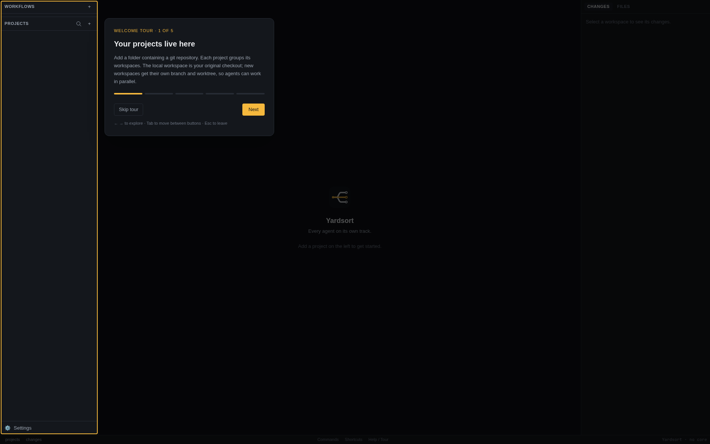

# Quick start

Install Yardsort, open a git repository and start a coding agent in a separate git worktree.
You need git and an agent CLI that already works in your terminal. For supported agents, costs
and how your data is handled, see [About Yardsort](guide/questions.md).

## 1. Before you start

Yardsort runs coding agents **you already have installed**. It does not bundle or replace them,
and it never sees your API keys — each agent uses its own login. You need:

- **git**
- at least one agent CLI that works in your terminal. Out of the box Yardsort knows
  [Claude Code](https://claude.com/claude-code) (`claude`), [Codex](https://github.com/openai/codex)
  (`codex`), Grok (`grok`), [OpenCode](https://opencode.ai) (`opencode`),
  [OMP](https://omp.sh/) (`omp`), [Cursor](https://cursor.com/cli) (`cursor-agent`) and
  [Pi](https://pi.dev/) (`pi`). Anything else that
  runs in a terminal can be [added in settings](guide/settings.md#adding-your-own-harness).

Check that it works where Yardsort will look for it — a fresh terminal:

```sh
claude --version
```

## 2. Install

Download the latest build for your system from the
[**Releases page**](https://github.com/joaoh82/yardsort/releases/latest).

| System      | File                             | Notes                                                                                                                                                                                                              |
| ----------- | -------------------------------- | ------------------------------------------------------------------------------------------------------------------------------------------------------------------------------------------------------------------ |
| **Linux**   | `.AppImage`, `.deb` or `.rpm`    | AppImage: `chmod +x Yardsort_*.AppImage` and run it, or [add it to your app menu](#linux-add-the-appimage-to-your-app-menu). An AUR package (`yardsort-bin`) is on its way; until then the AppImage works on Arch. |
| **macOS**   | `.dmg` (Apple Silicon and Intel) | Open it and drag Yardsort to Applications. Or with Homebrew: `brew install --cask joaoh82/yardsort/yardsort`.                                                                                                      |
| **Windows** | `-setup.exe` or `.msi`           | Builds are not code-signed yet, so SmartScreen warns: choose **More info → Run anyway**. Needs [Git for Windows](https://git-scm.com/download/win).                                                                |

Prefer to build it yourself? See [CONTRIBUTING.md](../CONTRIBUTING.md) — it is `just setup && just build`.

### Linux: add the AppImage to your app menu

An AppImage is a single file that runs from wherever it is, so it does not appear in your launcher
by itself. Give it a permanent home and a menu entry — run this in the folder you downloaded it to:

```sh
mkdir -p ~/Applications ~/.local/share/applications ~/.local/share/icons/hicolor/scalable/apps
mv Yardsort_*.AppImage ~/Applications/Yardsort.AppImage
chmod +x ~/Applications/Yardsort.AppImage
curl -fsSL https://raw.githubusercontent.com/joaoh82/yardsort/main/assets/icon.svg \
  -o ~/.local/share/icons/hicolor/scalable/apps/yardsort.svg
cat > ~/.local/share/applications/yardsort.desktop <<EOF
[Desktop Entry]
Type=Application
Name=Yardsort
Comment=Run AI coding agents in parallel, each in its own git worktree
Exec=$HOME/Applications/Yardsort.AppImage
Icon=yardsort
Terminal=false
Categories=Development;
StartupWMClass=Yardsort
EOF
```

Yardsort now shows up in your launcher (GNOME, KDE, Walker on Omarchy, rofi, …); some need a
moment, or a new session, to notice. Two details matter:

- **Keep the version out of the file name.** [Updates](guide/updates.md) replace the AppImage in
  place, so a fixed name keeps the menu entry working after every update.
- **Keep it somewhere you can write to**, such as your home folder — otherwise it cannot update
  itself.

To remove it again, delete those three files. Your projects and settings live elsewhere
(`~/.local/share/dev.yardsort.app`) and are not touched.

## 3. First launch

On the first launch of a profile, Yardsort asks whether you would like a quick tour. Choose
**Take the tour** to explore projects, workspaces and terminals, changes and files, workflows,
and settings. **Not now**, **Skip tour** or Escape dismisses it. Your choice is remembered,
including if you leave partway through; **Help / Tour** in the bottom bar replays it any time.
Existing profiles receive the invitation once after upgrading to the version with the tour.

The tour highlights the real panels and works even before you have a project or agent installed.
It creates no workspaces and starts no agents. Use Next / Back or ← / → to move through it,
Tab to reach buttons, and Finish to close. Collapsed panels return to their previous state when
you leave.



For keyboard navigation, **Mod+K** (⌘K on macOS, Ctrl+Shift+K elsewhere) finds commands and
workspaces. **Shortcuts** in the bottom bar opens the cheat sheet and binding editor; see
[Keyboard shortcuts](guide/shortcuts.md).

Yardsort looks for git and for the agents it knows, and the welcome screen tells you what it
found. If something is missing it shows how to install it, with a command you can copy; install
it, press **Check again** — no restart needed — and carry on. When everything is in place the
screen points you at the next step: adding a project. It also offers to install the
[`ys` command](guide/cli.md#installing), which is optional.

## 4. Add a project

Open Yardsort and press **+** next to _Projects_ (or `Ctrl+Shift+O` / `⌘O`).

- **Open a folder** — pick any git repository on your machine.
- **Clone a GitHub repository** — enter its URL, a local folder name, and a location.
- **Create a new project** — Yardsort makes the folder, runs `git init` and adds a first commit.

Your project appears on the left with one entry under it, **local**: your repository exactly as it
is on disk. Click it and you get a shell there.

## 5. Start a workspace

Press the **+** on the project row (or `Ctrl+Shift+N` / `⌘N`) and say what you want done:


Pick the agent, optionally a model and effort level, and press **Enter**. Yardsort then:

1. creates a new branch and a **git worktree** for it — a separate folder, so the agent cannot
   disturb your own checkout or any other agent;
2. starts the agent in that folder, in a real terminal, with your message as its first prompt.

The first time an agent sees a new folder it may ask whether you trust it; answer in the terminal
as you normally would.

## 6. Watch, review, repeat


- The **middle** is the agent's own terminal UI. Type to it exactly as you would anywhere else.
- The **right** lists every file the agent has touched, updating live. Click one for the diff.
- The **left** shows all your workspaces. Start another — in the same project or a different
  one — and they run side by side. A pulsing dot means an agent is working. The harness pill counts
  all open agent tabs, including finished ones; its amber tint means an agent is waiting for you.
  A **✓** means they have all finished successfully. Hover or keyboard-focus the pill to see each
  agent's name and activity, then select one to open its terminal.

When the work is done, it is an ordinary git branch: review it, push it, open a pull request —
from the agent, from a shell tab (`Ctrl+Shift+T`), or from your usual tools.

With the pull request open, **Request code review…** in the workspace's menu has a second agent
review it and post on GitHub, then tells you and the agent that wrote it. That is a
[workflow](guide/workflows.md); the **Workflows** section above Projects has it and any you write.

### Check tokens and machine resources

Open **Usage** beside **Settings** at the foot of the sidebar, or search for _Usage_ with
**Mod+K**. **Token usage** compares Claude Code, Codex and Grok over **7d**, **30d** or **90d**,
by day, agent, model and workspace. It reads their local logs, including sessions started outside
Yardsort, without requiring activity capture. **Cost** is an API-price estimate, not your
subscription bill; **Tokens** includes models whose price is unknown.

**Machine resources** shows live CPU and memory for Yardsort and all its terminals, including
programs the agents start. Sort by CPU or memory, expand a workspace to inspect its terminals,
or click its name to go back to work. Nothing is sent anywhere. See [Usage](guide/usage.md).

## 7. Come back later

Close the window whenever you like. With agents still working, choose **Leave them running**
to keep them in the background; reopening Yardsort reconnects to their terminals. **Stop them**
ends them instead. For a conversation that has ended, pick the workspace and press **Resume**
to reopen it with its conversation intact.


## Next

- [Workspaces](guide/workspaces.md) — branches, archiving, cleaning up
- [Terminals & sessions](guide/terminals-and-sessions.md) — resume, fork, notifications
- [Workflows](guide/workflows.md) — named agent work in steps, the built-in code review
- [Usage](guide/usage.md) — tokens, estimated API costs, plan limits and live CPU and memory
- [Settings & harnesses](guide/settings.md) — make an agent start the way you like
- [Keyboard shortcuts](guide/shortcuts.md)

## Try two agents in parallel

Continue with the [Claude Code and Codex tutorial](https://www.yardsort.sh/tutorials/claude-code-codex-parallel-worktrees/)
to create two independent workspaces, inspect their changes, and prepare focused pull requests.
